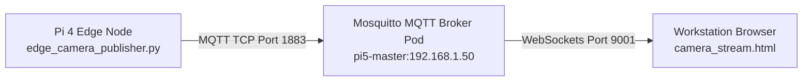

# Edge Camera Test Stream Guide

This guide describes how to configure, deploy, and observe the live telemetry camera stream from the physical Raspberry Pi 4 Edge Node (`pi4-edge` / `192.168.1.2`) to your local workstation.

!!! warning "Temporary Test Harness"
    The `camera_stream.html` file located at the root of the project is a **temporary visual test harness** designed strictly for initial telemetry integration, connectivity verification, frame-rate testing, and transit latency diagnostics. 
    
    It **will be replaced** by the formal React + TypeScript cluster-integrated frontend dashboard container deployed directly inside the K3s Kubernetes cluster for production.

---

## 1. Stream Architecture

The live camera stream operates via a decoupled publish/subscribe MQTT telemetry architecture:



* **Pi 4 Edge Node**: Ingests frames from the local camera module, resizes them to `320x240` (optimized for 100Mbps Ethernet network load), encodes them to JPEG inside memory, converts them to Base64, and publishes a JSON payload.
* **Pi 5 Master Node (Mosquitto)**: Orchestrates the broker pod within K3s, exposed externally via a `LoadBalancer` Service mapping MQTT TCP traffic (`1883`) and WebSockets (`9001`).
* **Workstation (HUD Client)**: Subscribes to the stream over WebSockets, parses JSON payloads on-the-fly, calculates telemetry stats, and displays live footage.

---

## 2. Command-Line Arguments & Configuration

The updated `edge_camera_publisher.py` script has a fully-featured argument parser, making it highly customizable without modifying the code on the Pi 4.

| Argument | Shorthand | Default | Description |
| :--- | :--- | :--- | :--- |
| `--broker` | `-b` | `192.168.1.50` | IP Address of the K3s MQTT Broker. |
| `--port` | `-p` | `1883` | TCP port of the MQTT Broker. |
| `--topic` | `-t` | `cluster/camera/stream` | MQTT topic to publish stream frames. |
| `--fps` | `-f` | `20` | Target frame rate (pacing sleep interval). |
| `--width` | `-w` | `320` | Capture frame width in pixels. |
| `--height` | `-g` | `240` | Capture frame height in pixels. |
| `--quality` | `-q` | `70` | JPEG compression quality percentage (1-100). |

---

## 3. Step-by-Step Observation Guide

Follow these steps to observe the camera stream from your machine:

### Step 3.1 — Sync & Copy the Publisher to the Edge Node
Ensure that you have committed and pushed the latest [edge_camera_publisher.py](file:///c:/Users/metro/Desktop/CLOUD/Threat-Detection-System/edge_node/edge_camera_publisher.py) file from your local workstation:

1. Push your local workspace changes to GitHub.
2. SSH into the **Pi 5 Master** (`192.168.1.50`) and pull the changes:
   ```bash
   cd ~/Threat-Detection-System
   git pull
   ```
3. Copy the updated publisher script from the master to the home directory of the Pi 4 Edge Node:
   ```bash
   scp ~/Threat-Detection-System/edge_node/edge_camera_publisher.py cc123@192.168.1.2:~/
   ```

### Step 3.2 — Start the Stream on the Pi 4 Edge Node
1. SSH into the **Pi 4 Edge Node** (`192.168.1.2`).
2. Ensure no other background services are locking the camera interface (e.g. stop any conflicting background detection daemon):
   ```bash
   sudo systemctl stop sensor-node.service
   ```
3. Run the camera publisher script. You can customize the target FPS using the `--fps` argument:
   ```bash
   # Run the stream at a smooth 20 FPS (Default)
   python3 ~/edge_camera_publisher.py --fps 20
   ```
   * *Note: The system will automatically prioritize OpenCV (`opencv`) to perform fast, low-overhead, in-memory frame captures. If OpenCV is unavailable or `/dev/video0` is busy, it safely falls back to native `rpicam-still` using a robust 100ms exposure warmup.*

### Step 3.3 — Launch the HUD Client
1. Locate the [camera_stream.html](file:///c:/Users/metro/Desktop/CLOUD/Threat-Detection-System/camera_stream.html) file at the root of your local workstation workspace.
2. Double-click to open it in any modern web browser.
3. Validate the connection settings in the **Configuration Panel**:
   * **Broker IP Address**: `192.168.1.50` (Pi 5 Master)
   * **Port (WebSockets)**: `9001`
4. Click **CONNECT STREAM**.
5. Observe the live stream and the real-time HUD analytics:
   * **Transit Latency**: End-to-end network lag (calculated using the edge frame's timestamp vs. client receive time).
   * **Render Frequency**: Rolling average of the true browser display FPS.
   * **Total Frames**: Total count of telemetry frames received.

---

## 4. Restoring the Node State After Verification

Once you have verified the live video stream, terminate the publisher and restore the system to its normal state:

1. Press `Ctrl+C` in the Pi 4 terminal to cleanly shut down the python publisher.
2. Restart your classmate's background detection service on the Pi 4 Edge Node:
   ```bash
   sudo systemctl start sensor-node.service
   ```

---

## 5. Observing YOLO Detection Events (MQTT)

When the Pi 4 Edge Node is running in its normal state (with the `sensor-node.service` active), it natively captures camera frames, runs YOLO object detection, and publishes clean JSON events directly into the cluster broker.

Follow these steps to verify that detection data is successfully flowing:

### Step 5.1 — Verify the Service on `pi4-edge`
1. SSH into the **Pi 4 Edge Node** (`192.168.1.2`).
2. Verify that the detection service is running and active:
   ```bash
   sudo systemctl status sensor-node.service
   ```
3. If the service was disconnected during a cluster power cycle, restart it to re-establish the connection to the Master broker:
   ```bash
   sudo systemctl restart sensor-node.service
   ```

### Step 5.2 — Watch the Detections on the Master (`pi5-master`)
1. Open a terminal on the **Pi 5 Master** (`192.168.1.50`).
2. Run the subscription tool to listen for clean YOLO JSON payloads as they pass through the broker:
   ```bash
   mosquitto_sub -h localhost -t 'cluster/camera/#' -v
   ```
   * *Note: Using the `#` wildcard will capture both stream raw data and processed events (`cluster/camera/events`).*

3. When the edge node publishes a detection without `image_base64`, the backend now reuses the latest `cluster/camera/stream` frame from the same node and stores that image in MinIO alongside the detection record.
