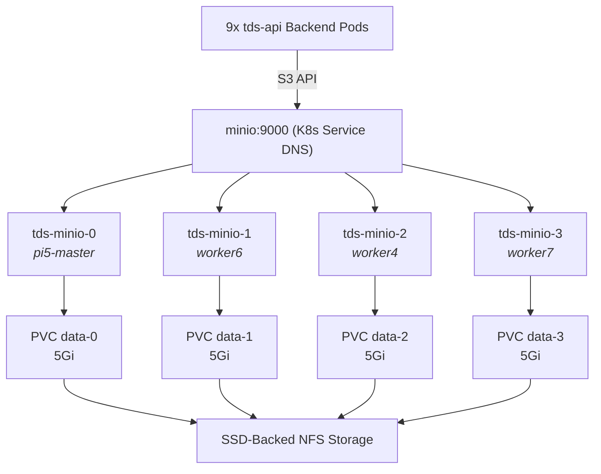

# MinIO S3 Object Storage Integration

This guide details how the S3-compatible **MinIO** object storage service is configured, deployed, and integrated as a **True 4-Node Distributed Cluster** within the K3s Kubernetes cluster to store high-resolution AI threat detection images.

---

## 1. Storage Architecture

MinIO is deployed inside Kubernetes as a **4-node Distributed StatefulSet cluster** utilizing erasure coding. Example:



### Key Integration Highlights:
* **True Hardware Redundancy**: By enforcing strict `podAntiAffinity` rules, Kubernetes distributes the 4 MinIO pods across **4 separate physical Raspberry Pi nodes**.
* **Headless Network Topology**: The pods are coordinated via a headless network service `minio-sys` using their native cluster DNS names:
  `http://tds-minio-{0...3}.minio-sys.default.svc.cluster.local/data`
* **Erasure Coding & Self-Healing**: MinIO automatically pools the 4 independent drives into a single, high-availability S3 storage bucket. The cluster can tolerate the complete physical crash of any worker node with zero data loss or service disruption!
* **Auto-ensured Buckets**: The FastAPI application automatically checks and creates the target bucket `detection-images` at startup, guaranteeing a zero-configuration environment.

---

## 2. Deploying the Distributed Cluster

The storage configuration is defined as infrastructure-as-code under [minio.yaml](../../k8s/minio.yaml).

### Manifest Breakdown:
1. **Headless Service (`minio-sys`)**: Facilitates internal cluster routing and disk peer communication between MinIO nodes.
2. **StatefulSet (`tds-minio`)**: Manages the 4 persistent MinIO container replicas, utilizing strict `podAntiAffinity` and mounting the unique auto-created PVC volumes.
3. **Lightweight Resource Limits**: Tuned to run at maximum efficiency on Raspberry Pi 3 workers with `128Mi` RAM requests.
4. **Public Service (`minio`)**: Exposes the cluster externally via `LoadBalancer`:
   * **Port 9000** (S3 API Endpoint) -> used by the backend pods.
   * **Port 9091** (Web Console UI) -> exposed on host for developers to audit files (avoiding port 9001 collision).

### NFS Compatibility Environment Variables
Because all worker nodes are **diskless PXE/NFS-booted Raspberry Pis**, the MinIO StatefulSet requires two special environment variables to operate correctly on NFS-backed PersistentVolumes:

| Variable | Value | Purpose |
|---|---|---|
| `MINIO_API_ODIRECT` | `off` | NFS does not support POSIX Direct I/O (`O_DIRECT`). Disabling it allows MinIO to use the standard Linux page cache for reads and writes. |
| `MINIO_CI_CD` | `on` | On NFS-booted workers, both `/` and `/data` report device `major: 0` (NFS pseudo-device). MinIO's safety check falsely detects `/data` as part of the root drive and refuses to use it. This variable disables that check. |

> ⚠️ **Note**: These variables are **only required** because the cluster uses NFS-backed storage.

To apply or update the MinIO setup:
```bash
# 1. Apply the new distributed configuration
kubectl apply -f k8s/minio.yaml
```

---

## 3. Accessing the MinIO Web Console

You can audit uploaded threat images and browse the S3 bucket contents directly in your browser.

### Step 1 — Verify Distributed Pod Status
Ensure all 4 replicas are successfully running and distributed across different nodes:
```bash
kubectl get pods -l "app=tds-minio" -o wide
```

### Step 2 — Open the Console
Open a browser on your PC workstation and navigate to:
👉 **`http://192.168.1.50:9091`**

### Step 3 — Log In
Enter the pre-configured credentials:
* **Access Key / Username**: `admin`
* **Secret Key / Password**: `password123`

After login, the console opens the **Object Browser** view. You should see the `detection-images` bucket (auto-created by the FastAPI backend on startup). From here you can browse, upload, and download stored threat detection images.

---

## 4. Verifying Distributed Cluster Health (CLI)

The MinIO web console looks identical in single-node and distributed modes. Use the CLI to confirm the erasure-coded cluster is healthy:

### Check Cluster Health Endpoint
```bash
kubectl exec -it tds-minio-0 -- curl -s -o /dev/null -w "%{http_code}" http://localhost:9000/minio/health/cluster
# Expected output: 200
```

### Verify Startup Logs
The most definitive proof of distributed mode is in the pod startup logs:
```bash
kubectl logs tds-minio-0 --tail=20
```

Look for these key lines:
```text
INFO: Formatting 1st pool, 1 set(s), 4 drives per set.      ← Erasure coding across 4 nodes
INFO: All MinIO sub-systems initialized successfully          ← Cluster quorum achieved
```

A single-node MinIO would report `1 drive per set`. Seeing `4 drives per set` confirms the distributed erasure-coded cluster is fully operational.
