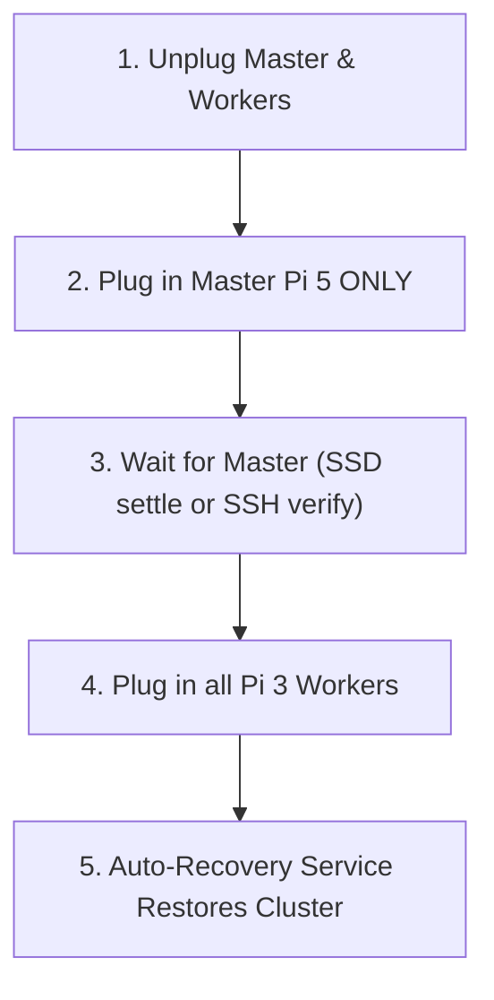

# 🔌 Cluster Shutdown and Cold Start Guide

This guide outlines the **Golden Boot Sequence**, **Clean Shutdown Sequence**, and troubleshooting procedures for managing the Raspberry Pi Threat Detection System (TDS) cluster during power cycles, blackout recovery, or system maintenance.

---

## 1. System Architecture Context

The TDS cluster consists of:
* **1x Raspberry Pi 5 Master (`pi5-master`):** Runs the K3s Control Plane, a persistent PostgreSQL database, and a Mosquitto MQTT broker. Crucially, it hosts an **external 500GB SSD** and acts as the **TFTP/NFS Network Boot Server** for all workers.
* **8x Raspberry Pi 3 B+ Workers (`worker1` to `worker8`):** **Diskless/SD-card-less nodes**. They contain no local storage and must network-boot (PXE) their operating systems directly from the Master Pi 5's SSD over a private ethernet switch.

Because the workers are entirely dependent on the Master to boot, **they must never be powered on before the Master's storage and network boot services are fully operational.**

---

## 2. ⏱️ The Golden Boot Sequence (Recover in 3 Mins)

To ensure the cluster bootstraps successfully on the first try without any manual SSH commands, follow this sequence:



### Step 1: Complete Power Isolation
Unplug the power sources for both the `pi5-master` and the private network switch / multi-port power supply feeding the `Pi 3 Workers`.

### Step 2: Boot the Master First
Plug in the **Pi 5 Master ONLY**.

### Step 3: Wait for the SSD Activity Light to Settle (~1.5 to 2 Minutes)
Watch the activity LED on the external SSD connected to the Pi 5 Master:
* **Rapid Flashing:** The Master is currently booting its own operating system and launching the K3s control plane.
* **Ready State (Steady Pulse or Faint/Off):** The Master has finished booting. Its system clock has synced, the NFS storage bind-mounts are active, and the network boot server is warm.

#### 🔍 Verification via SSH (Highly Recommended)
To be absolutely sure the Master is ready to boot the workers, SSH into the Master and verify that the TFTP and NFS services are active and the recovery script is waiting:

1. **SSH into the Pi 5 Master:**
   ```bash
   ssh cc123@pi5-master
   # OR use the IP address (e.g., 192.168.1.50 or the Wi-Fi DHCP IP)
   ssh cc123@192.168.1.50
   ```

2. **Verify that the DHCP, TFTP, and NFS boot services are active:**
   ```bash
   systemctl is-active dnsmasq nfs-kernel-server
   ```
   *Expected output:*
   ```text
   active
   active
   ```

3. **Check the boot recovery service logs:**
   ```bash
   sudo journalctl -u cluster-recovery -n 25 --no-pager
   ```
   *Expected output: Look for the initial waiting message or the recurring connection attempt lines:*
   ```text
   [INFO] YYYY-MM-DD HH:MM:SS - Waiting for workers to boot and open SSH (Port 22)...
   # OR
   [INFO] YYYY-MM-DD HH:MM:SS - Waiting for worker SSH connectivity... Attempt X/30
   ```

Once these checks pass, proceed to Step 4.

### Step 4: Power the Workers
Plug in the power source for the **8x Pi 3 Workers** all at once. 
* Since the network boot server is already warm and waiting, all 8 nodes will boot cleanly in parallel off the SSD and register in K8s.

---

## 3. ⚖️ Post-Boot Check & Pod Redistribution

Because the Master Pi 5 boots significantly faster than the network-booted Pi 3 workers, the Kubernetes scheduler may temporarily schedule all API replicas on the Master node because the workers are still in `NotReady` status during boot. 

Once all nodes are online, you should verify the cluster health and redistribute the API pods/replicas evenly across the workers.

### Step 1: Monitor Cluster and Pod Status (Live Watch)
To monitor the status and node placement of all system pods in real-time as they boot, use the `watch` command:
```bash
watch -n 2 "sudo kubectl get pods -l 'app in (tds-api, tds-postgres, tds-minio, tds-mqtt)' -o wide"
```
Or to watch all pods across all namespaces:
```bash
watch -n 2 "sudo kubectl get pods -A -o wide"
```
*Verify that all pods eventually transition to `1/1 Running` and get assigned IPs. Under normal operation, the system is fully functional once 1 API pod, 3 MinIO pods, 1 Postgres pod, and 1 MQTT pod are healthy.*

### Step 2: Trigger Pod Redistribution (If unevenly distributed)
If you notice that most `tds-api` pods are running on `pi5-master` instead of being balanced across the workers (i.e., they are unevenly distributed), trigger a rolling restart to force the scheduler to redistribute them:
```bash
sudo kubectl rollout restart deployment tds-api
```
*This will safely terminate the pods one by one and reschedule them across the newly active worker nodes in accordance with pod anti-affinity rules.*

To watch the rolling restart and redistribution happen live, you can run:
```bash
watch -n 1 "sudo kubectl get pods -l app=tds-api -o wide"
```

---

## 4. 🛡️ The Self-Healing Boot Automation

Upon Master boot, a dedicated, persistent systemd unit (`cluster-recovery.service`) automatically executes `/usr/local/bin/cluster-boot-recovery.sh` to handle the entire cluster synchronization hands-free.

The automation performs the following steps in sequence:
1. **NFS Bind-Mount Verification:** Ensures `/mnt/ssd/nfs` is successfully bound to `/nfs` to prepare the workers' filesystems.
2. **IP Forwarding & NAT Masquerading:** Configures the Master as a gateway so workers have internet access through the Master's Wi-Fi card.
3. **NTP Clock Synchronization:** Holds back K3s and worker boot checks until the Master synchronizes its system clock with the internet via NTP.
4. **Boot Services Restart:** Restarts `dnsmasq` (DHCP/TFTP) and `nfs-kernel-server` **after** the clock sync, avoiding DHCP lease database corruption.
5. **Worker Time Sync Push:** Waits for the workers' SSH ports to open, then automatically syncs their clocks to the Master to prevent TLS certificate validation failures.
6. **Worker Agent Reload:** Restarts the `k3s-agent` on all workers to clear containerd locks.
7. **Ghost Pod Pruning:** Scans all namespaces and force-deletes any pods stuck in `Unknown` or `CreateContainerError` states.

---

## 5. 🔍 Hardware Diagnostic Led Guide

Use these physical indicators on the boards to diagnose boot stages:

| Component | LED Behavior | System Meaning | Action Required |
| :--- | :--- | :--- | :--- |
| **Pi 3 Worker Board** | 🔴 Solid Red ONLY | Board has power, but the bootloader failed to load the kernel and is now **hung**. | Unplug the worker power supply, wait 3 seconds, and plug back in. |
| **Pi 3 Worker Board** | 🟢 Flashing Green | The CPU is actively booting the Linux OS off the network SSD. | None. Node is successfully starting up. |
| **Worker Ethernet Port** | 🟠 Solid Orange | 100Mbps physical network carrier link is active. | None. Physical connection is healthy. |
| **Worker Ethernet Port** | 🟢 Blinking Green | Node is actively transmitting/receiving data packets (e.g., requesting DHCP). | None. |
| **External SSD** | 🔵 Blinking/Flashing | Active read/write operations (e.g., workers are booting or pods are running). | None. |
| **External SSD** | 🌑 Completely Dark | The SSD is idle. No network file operations are happening. | If workers are stuck in Solid Red, they booted too early and aren't hitting the SSD. Power-cycle the workers. |

---

## 6. 🛠️ Emergency Manual Troubleshooting Commands

If the boot sequence is messed up, log into `pi5-master` via SSH and run these commands to restore health:

### A. Run a Manual Cluster-Wide Sync & Cleanup
If the nodes booted out of order or some nodes have drifted clocks, you can trigger our full recovery script manually to heal the entire cluster:
```bash
sudo /usr/local/bin/cluster-boot-recovery.sh
```

### B. Manually Synchronize Worker Clocks (Ansible)
If the workers have drifted clocks causing `Unknown` pods due to TLS validation failures:
```bash
# 1. Sync time to all workers
sudo -u cc123 ansible workers -i ~/pi-cluster/hosts.ini -m shell -a "date -s '$(date -u +%FT%TZ)'" --become

# 2. Restart K3s agents to flush sandbox cache
sudo -u cc123 ansible workers -i ~/pi-cluster/hosts.ini -m shell -a "systemctl restart k3s-agent" --become
```

### C. Recover a Deadlocked Worker Node (SysRq Hardware Reset)
If a worker node's `systemd` deadlocks (`timed out waiting for service 'org.freedesktop.systemd1'`) due to network locks during a power cut, it will ignore standard reboot commands. Force a hardware reset immediately over SSH:
```bash
sudo -u cc123 ansible worker7 -i ~/pi-cluster/hosts.ini -m shell -a "echo 1 > /proc/sys/kernel/sysrq && echo b > /proc/sysrq-trigger" --become
```

---

## 7. 🔌 Clean Shutdown & Power-Off Sequence

To prevent database corruption on the external SSD or dirty NFS filesystem locks, **never abruptly cut power while the cluster is active.** Always execute this clean shutdown sequence:

### Step 1: Shut down all Workers cleanly (Ansible)
Flush all memory caches and safely shut down all 8 network-booted Pi 3 nodes:
```bash
sudo -u cc123 ansible workers -i ~/pi-cluster/hosts.ini -m shell -a "shutdown -h now" --become
```

### Step 2: Stop the K3s Control Plane and Databases
Stop the K3s engine on the Master to flush all database buffers (PostgreSQL, MQTT, and Kine transaction databases) to the SSD:
```bash
sudo systemctl stop k3s
```

### Step 3: Shut down the Master Pi 5 cleanly
Shut down the Master's operating system:
```bash
sudo shutdown -h now
```

### Step 4: Physical Power Cut
1. Wait 10–15 seconds for the Pi 5's green activity light to stop blinking and turn off completely.
2. Once only the red power LED remains lit on the Master, it is **100% safe to unplug all power cables** from the wall.
