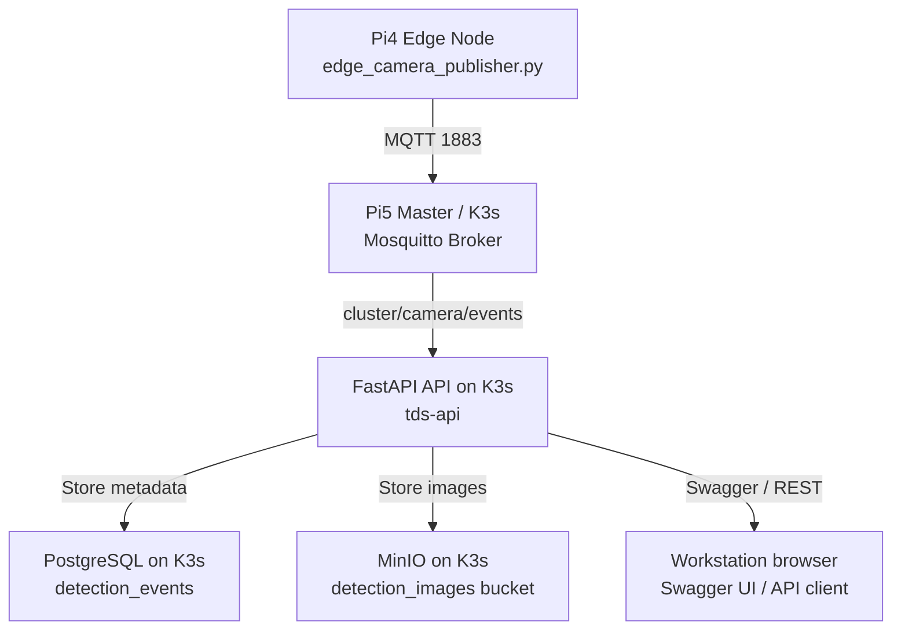
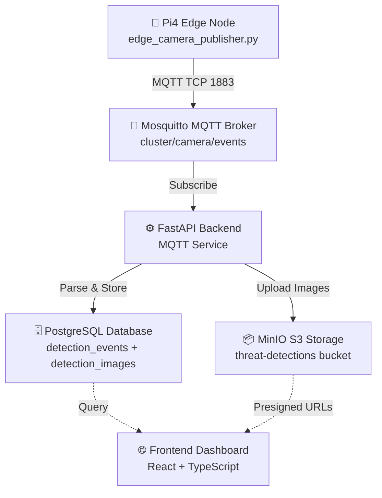

# Camera Stream Detection: Capture, Database & Storage

This guide explains how the camera stream is captured, how YOLO detections are published, and how the backend stores event metadata in PostgreSQL and images in MinIO.

---

## Network Architecture



**Current setup:** K3s is already running on Pi5 and the backend is deployed there.

---

## System Overview



### Data Flow

1. **Edge Node** captures frames and runs YOLO detection
2. **Detection Event** published to MQTT `cluster/camera/events` topic with:
   - Frame as Base64 JPEG
   - Detection metadata (labels, confidence, bounding boxes)
   - Timestamp and sensor info
3. **MQTT Subscriber** (FastAPI background task) receives message
4. **Detection Service** extracts image and creates database records:
   - `DetectionEvent` row (event metadata)
   - `DetectionImage` row (storage reference)
5. **Image Storage** uploads Base64 image to MinIO
6. **API Endpoints** expose data via Swagger/REST for querying

---

## Current Setup Architecture

### ✅ Production Deployment: K3s Cluster (ACTIVE)

Your system is **running on Kubernetes (K3s)** on Pi5 Master:

```
┌─ Pi5 Master (192.168.1.50) - K3s Control Plane
│  ├─ tds-api: 9 replicas (distributed across nodes)
│  ├─ tds-postgres: 1 (master)
│  ├─ tds-minio: 4 replicas (distributed)
│  └─ tds-mqtt: 1 (master)
│
├─ Worker Nodes (worker1-8)
│  └─ Running API replicas for load distribution
│
└─ External Access
   └─ Via Service (NodePort/LoadBalancer)
```

**Status:** ✅ All services deployed and running

---

## Setup & Configuration

### 1. K3s Deployment Status

Your system is already deployed on K3s! All services are running:

```bash
ssh cc123@192.168.1.50

# Check all TDS services
kubectl get pods -l 'app in (tds-api, tds-postgres, tds-minio, tds-mqtt)'
kubectl get svc -l 'app in (tds-api, tds-postgres, tds-minio, tds-mqtt)'
```

### 2. Verify Backend Services

**Run the automated test script:**

```bash
ssh cc123@192.168.1.50
chmod +x Threat-Detection-System/test-api-from-k3s.sh
./Threat-Detection-System/test-api-from-k3s.sh
```

**Or manually check:**

```bash
# Check API pods
kubectl get pods -l app=tds-api -o wide

# Test API connectivity (internal)
curl http://tds-api:8001/api/v1/detections

# Access Swagger UI (via port-forward)
kubectl port-forward svc/tds-api 8001:8001 &
# Then: http://localhost:8001/docs
```

### 3. Database Status

PostgreSQL is running and migrations are applied automatically:

```bash
# Check database pod
kubectl get pods -l app=tds-postgres -o wide

# View logs
kubectl logs -l app=tds-postgres
```

---

## Edge Node Configuration & Deployment

### Prerequisites on Pi4 Edge Node

```bash
# Install Python dependencies
pip install --upgrade paho-mqtt ultralytics opencv-python

# Download YOLO model (first run only, ~40MB)
python3 -c "from ultralytics import YOLO; YOLO('yolov8n.pt')"

# Verify camera access
ls -la /dev/video0
```

### Find Your Correct IP Address

To discover which IP to use for your workstation:

```bash
# From Pi5 (to find your workstation)
ping <your_workstation_hostname>
hostname -I

# From your workstation (to find Pi5)
ping pi5-master
ping 192.168.1.50

# Check Docker container IPs
docker inspect tds-api | grep '"IPAddress"'
```

### Run Camera Publisher with YOLO Detection

**Important: Use 192.168.1.50 (K3s MQTT broker on Pi5)**

**Option 1: Default Settings (20 FPS, Raw Stream Only)**

```bash
python3 edge_camera_publisher.py --broker 192.168.1.50
```

**Option 2: With YOLO Detection Enabled**

```bash
python3 edge_camera_publisher.py \
  --broker 192.168.1.50 \
  --enable-detections \
  --fps 10 \
  --confidence 0.5
```

**Option 3: Detection Events Only (No Stream)**

```bash
python3 edge_camera_publisher.py \
  --broker 192.168.1.50 \
  --enable-detections \
  --disable-stream \
  --yolo-model yolov8s.pt \
  --fps 5
```

### Command-Line Arguments

| Argument | Default | Description |
|----------|---------|-------------|
| `--broker` | `192.168.1.50` | MQTT Broker IP (K3s on Pi5) |
| `--port` | `1883` | MQTT Broker port |
| `--fps` | `20` | Frames per second |
| `--width` | `320` | Frame width (pixels) |
| `--height` | `240` | Frame height (pixels) |
| `--quality` | `70` | JPEG quality (1-100) |
| `--yolo-model` | `yolov8n.pt` | YOLO model name/path |
| `--confidence` | `0.5` | Detection confidence threshold (0.0-1.0) |
| `--enable-detections` | `true` | Enable YOLO object detection |
| `--disable-stream` | `false` | Disable raw stream (events only) |
| `--sensor-id` | `UUID` | Unique sensor identifier |

---

## Testing the Complete Flow

### Before You Start

**From your workstation:**
- Use `kubectl port-forward svc/tds-api 8001:8001` on Pi5 and open `http://localhost:8001/docs`
- Or use the NodePort / LoadBalancer address shown by `kubectl get svc tds-api`

**From Pi5:**
- Use `http://tds-api:8001` for internal service access
- Use `localhost` for services you port-forward

See [Test API from K3s](test-api-from-k3s.md) for the full validation checklist.

### Step 1: Monitor MQTT Messages

**Terminal 1 - Watch detection events (from Pi5):**

```bash
ssh cc123@192.168.1.50

# Subscribe to camera events
mosquitto_sub -h localhost -t 'cluster/camera/events' -v
```

Expected output:

```
cluster/camera/events {
  "timestamp":"2026-06-25T10:30:45.123456Z",
  "node":"pi4-edge",
  "sensor_id":"550e8400-e29b-41d4-a716-446655440000",
  "event_type":"person",
  "objects":1,
  "label":"person",
  "confidence":0.92,
  "severity":"low",
  "raw_detections":[{"class":0,"class_name":"person","confidence":0.92,"bbox":{...}}],
  "image_base64":"...",
  "metadata":{...}
}
```

### Step 2: Verify Backend Ingestion

**Terminal 2 - Check backend logs:**

```bash
ssh cc123@192.168.1.50
kubectl logs -f -l app=tds-api
```

Look for messages like:

```
INFO [app.services.mqtt_service] Ingested camera event from pi4-edge: person (confidence: 0.92)
INFO [app.services.image_storage_service] ✅ MinIO bucket verified: detection-images
```

### Step 3: Query Database

**Access PostgreSQL:**

```bash
ssh cc123@192.168.1.50
kubectl port-forward svc/tds-postgres 5432:5432 &
```

Then connect from your workstation:

```bash
psql -h localhost -U tds_user -d threat_detection
```

**Check detection events:**

```sql
SELECT id, event_type, severity, confidence, detected_at 
FROM detection_events 
ORDER BY created_at DESC 
LIMIT 10;
```

**Check stored images:**

```sql
SELECT de.id as event_id, di.storage_key, di.file_size_bytes, di.image_type
FROM detection_events de
JOIN detection_images di ON di.detection_event_id = de.id
ORDER BY de.created_at DESC
LIMIT 10;
```

### Step 4: Verify MinIO Storage

**Via K3s Port-Forward:**

```bash
ssh cc123@192.168.1.50

# Port-forward MinIO console
kubectl port-forward svc/tds-minio-console 9001:9001 &

# On your workstation:
# http://localhost:9001
# Login: admin / password123
```

1. Browse `detection-images` bucket
2. Should see folders like `detections/{event_id}/annotated.jpg`

**Via K3s exec:**

```bash
ssh cc123@192.168.1.50

# Check MinIO pods
kubectl get pods -l app=tds-minio
```

---

## API Endpoints (Swagger Documentation)

### Access Swagger UI

#### From Your Workstation (via K3s Port-Forward)
```bash
ssh cc123@192.168.1.50
kubectl port-forward svc/tds-api 8001:8001 &

# Then open: http://localhost:8001/docs
```

#### From Pi5 Master (Internal K3s Access)
```bash
ssh cc123@192.168.1.50

# Direct access via service DNS
curl http://tds-api:8001/api/v1/detections

# Test Swagger UI
curl http://tds-api:8001/docs
```

#### Via LoadBalancer/NodePort
```bash
ssh cc123@192.168.1.50
kubectl get svc tds-api -o wide

# If EXTERNAL-IP is shown, access externally
# Otherwise check NodePort and use: http://192.168.1.50:NODEPORT/docs
```

---

### Detections Endpoints

#### 1. List All Detection Events

```bash
GET /api/v1/detections
  ?event_type=person
  &severity=high
  &skip=0
  &limit=50
```

**Response:**

```json
{
  "items": [
    {
      "id": "550e8400-e29b-41d4-a716-446655440000",
      "sensor_node_id": "...",
      "event_type": "person",
      "severity": "low",
      "confidence": 0.92,
      "raw_detections": [...],
      "detected_at": "2026-06-25T10:30:45Z",
      "received_at": "2026-06-25T10:30:46Z",
      "created_at": "2026-06-25T10:30:46Z"
    }
  ],
  "total": 42,
  "skip": 0,
  "limit": 50
}
```

#### 2. Get Recent Detections

```bash
GET /api/v1/detections/recent?limit=20
```

#### 3. Get Detection Statistics

```bash
GET /api/v1/detections/statistics
```

**Response:**

```json
{
  "total_events": 156,
  "by_type": {
    "person": 102,
    "weapon": 18,
    "edged_weapon": 25,
    "blunt_weapon": 11
  },
  "by_severity": {
    "low": 102,
    "medium": 0,
    "high": 36,
    "critical": 18
  },
  "unacknowledged_count": 12
}
```

#### 4. Get Single Detection with Images

```bash
GET /api/v1/detections/{event_id}
```

**Response:**

```json
{
  "id": "550e8400-e29b-41d4-a716-446655440000",
  "sensor_node_id": "...",
  "event_type": "person",
  "severity": "low",
  "confidence": 0.92,
  "detected_at": "2026-06-25T10:30:45Z",
  "sensor_name": "pi4-edge",
  "sensor_location": "Front Entrance",
  "images": [
    {
      "id": "...",
      "detection_event_id": "550e8400-e29b-41d4-a716-446655440000",
      "storage_key": "detections/550e8400-e29b-41d4-a716-446655440000/annotated.jpg",
      "bucket": "detection-images",
      "content_type": "image/jpeg",
      "file_size_bytes": 24576,
      "image_type": "annotated",
      "captured_at": "2026-06-25T10:30:45Z",
      "uploaded_at": "2026-06-25T10:30:46Z"
    }
  ]
}
```

#### 5. Acknowledge Detection

```bash
PATCH /api/v1/detections/{event_id}/acknowledge
```

### Images Endpoints

#### 1. Download Image

```bash
GET /api/v1/images/{image_id}/download

# Returns raw JPEG bytes with Content-Type: image/jpeg
```

#### 2. Get Presigned URL (Direct MinIO Access)

```bash
GET /api/v1/images/{image_id}/url
```

**Response:**

```json
{
  "url": "http://minio:9000/detection-images/detections/550e8400-e29b-41d4-a716-446655440000/annotated.jpg?X-Amz-Algorithm=AWS4-HMAC-SHA256&..."
}
```

#### 3. Get Images by Event

```bash
GET /api/v1/images/by-event/{event_id}
```

#### 4. Delete Image (Admin Only)

```bash
DELETE /api/v1/images/{image_id}
```

---

## Database Schema

### detection_events Table

```sql
CREATE TABLE detection_events (
    id UUID PRIMARY KEY,
    sensor_node_id UUID NOT NULL REFERENCES sensor_nodes(id),
    event_type VARCHAR(50) NOT NULL,
    severity VARCHAR(20) NOT NULL,  -- low, medium, high, critical
    confidence FLOAT NOT NULL,       -- 0.0 to 1.0
    raw_detections JSONB,            -- YOLO detection data
    metadata JSONB,
    acknowledged BOOLEAN DEFAULT false,
    acknowledged_by VARCHAR(150),
    detected_at TIMESTAMP WITH TIME ZONE,
    received_at TIMESTAMP WITH TIME ZONE,
    created_at TIMESTAMP WITH TIME ZONE
);
```

### detection_images Table

```sql
CREATE TABLE detection_images (
    id UUID PRIMARY KEY,
    detection_event_id UUID NOT NULL REFERENCES detection_events(id),
    storage_key VARCHAR(512) NOT NULL,  -- MinIO path
    bucket VARCHAR(100) NOT NULL,
    content_type VARCHAR(50),
    file_size_bytes INTEGER,
    image_type VARCHAR(20),              -- annotated, raw, thumbnail
    captured_at TIMESTAMP WITH TIME ZONE,
    uploaded_at TIMESTAMP WITH TIME ZONE
);
```

---

## Troubleshooting

### MQTT Messages Not Being Ingested

**Check MQTT Broker Status:**

```bash
# Verify connection
docker-compose logs mqtt

# Test mosquitto connectivity
mosquitto_sub -h localhost -t 'cluster/camera/events' -v
```

**Check Backend MQTT Subscriber:**

```bash
# View logs
docker-compose logs api | grep -i mqtt

# Verify subscriptions
curl http://localhost:8001/api/v1/infrastructure/mqtt-status
```

### Images Not Saving to MinIO

**Check MinIO Connection:**

```bash
# Verify MinIO is running
curl http://localhost:9000

# Check MinIO logs
docker-compose logs minio

# Verify bucket exists
docker-compose exec minio mc ls minio/detection-images
```

**Fix MinIO Credentials:**

Update `backend/.env`:

```
MINIO_ENDPOINT=minio:9000
MINIO_ACCESS_KEY=admin
MINIO_SECRET_KEY=password123
```

### Database Errors

**Check PostgreSQL:**

```bash
# View logs
docker-compose logs postgres

# Restart database
docker-compose restart postgres

# Run migrations
docker-compose exec api alembic upgrade head
```

### Camera Not Detected

**On Pi4 Edge Node:**

```bash
# List video devices
ls -la /dev/video*

# Test with libcamera
libcamera-still -o test.jpg

# Test with rpicam
rpicam-still -o test.jpg

# Check camera permissions
groups $USER  # Should include video group
```

---

## Performance Tuning

### Reduce MQTT Message Size

Lower JPEG quality to decrease payload:

```bash
python3 edge_camera_publisher.py --quality 50 --fps 5
```

### Use Smaller YOLO Model

For faster inference on Pi4:

```bash
python3 edge_camera_publisher.py --yolo-model yolov8n.pt  # Nano - fastest
# Or
python3 edge_camera_publisher.py --yolo-model yolov8s.pt  # Small
```

### Disable Raw Stream

If only detection events needed:

```bash
python3 edge_camera_publisher.py --disable-stream --enable-detections
```

### Database Query Optimization

Add indexes in PostgreSQL:

```sql
CREATE INDEX idx_detection_events_severity ON detection_events(severity);
CREATE INDEX idx_detection_events_created_at ON detection_events(created_at DESC);
```

---

## Next Steps

1. **Monitor Dashboard**: Build frontend to display real-time events
2. **Notifications**: Configure Telegram alerts for CRITICAL events
3. **Analytics**: Generate threat reports and statistics
4. **Model Training**: Retrain YOLO with custom weapon detection dataset
5. **Edge Caching**: Add local SQLite cache on Pi4 for offline operation

---

## Quick Reference

| Component | URL/Port | Access From | Status |
|-----------|----------|-------------|--------|
| FastAPI Docs | http://192.168.10.144:8001/docs | Your workstation | ✅ Active |
| PostgreSQL | 192.168.10.144:5432 | Docker Compose network | ✅ Running |
| MinIO Dashboard | http://192.168.10.144:9001 | Your workstation | ✅ Active |
| MQTT Broker | 192.168.10.144:1883 | Docker Compose network | ✅ Running |
| **Pi5 Master** | 192.168.1.50 | Your network | 🔌 Available |

### ⚠️ Note: IP Address Clarification

Your machine: `192.168.10.144` (local network)  
Pi5 Master: `192.168.1.50` (separate network)  
Backend API currently runs on your machine via Docker Compose

**To test from Pi5:**
```bash
ssh cc123@192.168.1.50
curl http://192.168.10.144:8001/api/v1/detections
```

See [Test API from Pi5](test-api-from-pi5.md) for detailed testing guide.

