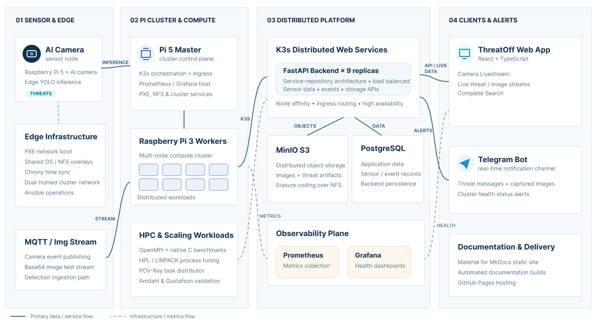

# Overall Tasks Status

Welcome to the project task board and status overview. This dashboard lists all key milestones, design decisions, work packages, lead developers, and live progress indicators for the **Threat Detection System** edge-computing cluster.

---

## Tasks Progress Matrix

The following table summarizes the work packages defined for this project, who is taking the lead, and their current completion status. Other team members should fill in their respective tasks.

| Task | Category | Lead Developer | Status | Core Focus / Deliverables |
|---|---|---|---|---|
| **Task 1** | [Edge Infrastructure](task-01-edge-computing-infrastructure.md) | **Mohsin Abbasi / Hafiza Fatima Athar** | Completed | PXE network booting configuration, shared OS image overlays, chrony synchronization, and AI camera MQTT setup. |
| **Task 2** | [HPL Performance](task-02-hpl.md) | **Maham Anis** | In Progress | HPL/LINPACK benchmarks on 2/4/7 nodes. 8-node tests blocked by admin/TCP issues. Results in `performance_using_hpl.md`. |
| **Task 3** | [MPI Cluster](task-03-mpi.md) | **Sadia Saeed** | In Progress | MPI deployment, native C benchmarks, Amdahl's/Gustafson's Laws on 32 cores. Metrics on master SSD. |
| **Task 4** | [Non-MPI Scaling](task-04-non-mpi-scaling-laws.md) | **Musfir & Sadia Saeed** | Done | Task distributor: repo setup, worker deployment, scalability law benchmarks. Results on SSD. |
| **Task 5** | [Monitoring](task-05-monitoring.md) | **Awais Yaseen** | Done | Deploying Prometheus and Grafana on the Pi 5 Master with a flexible setup, allowing us to choose the easiest worker metrics collection method later without disrupting cluster operations. |
| **Task 6** | [Object Detection Model](task-06-model-training.md) | **Muhammad Musfir** | Done | YOLO11n/YOLO8n python scripts and weights, Roboflow dataset, YOLO8n RPI4 configuration and performance metrics. |
| **Task 7** | [Backend](task-07-backend.md) | **Abdul Hanan Javaid & Md. Forman Ullah Sajib** | Done | FastAPI service-repository backend, 9 replicas on K3s, and distributed MinIO S3 storage. |
| **Task 8** | [Frontend](task-08-frontend.md) | **Md. Forman Ullah Sajib & Javier de Santiago Soto** | Done | React 19 + TypeScript SPA (ThreatOff Dashboard): JWT auth, live WebSocket camera stream, real-time detection polling, historical event search, embedded scaling-law graphs, Nginx + Docker + k3s deployment. |
| **Task 9** | [Telegram Bot](task-09-telegram.md) | **Abdul Hanan Javaid** | Done | Send real-time messages, images, and health status alerts using a Telegram bot. |
| **Task 10** | [Documentation](task-10-documentation.md) | Complete Team | Completed | Static site with Material theme, automated builds, and GitHub Pages hosting. |

---

## Task-by-Task Details

---

### Task 1 — Sensor Nodes & PXE Boot Setup
*   **Lead Developer:** Mohsin Abbasi / Hafiza Fatima Athar
*   **Proposed Approach & Solution:**
    *   **Diskless Network Booting:** Configure a Raspberry Pi 5 Master with DHCP, TFTP, and NFS service suites to boot 8 Raspberry Pi 3 workers over a private switch subnet, mounting writable RAM overlays for private states.
    *   **Time & Camera Services:** Coordinate NTP sync using chrony client-server configurations. Integrate a Pi 4 with an AI camera to publish object detection event telemetry natively over MQTT.
*   **Current Work Status:**
    *   **Completed.** Network booting, clocks synchronization, and automated camera telemetry publishing services are fully operational.

---

### Task 2 — HPL Benchmarking
*   **Lead Developer:** Maham Anis
*   **Proposed Approach & Solution:**
    *   **LINPACK Suite Compilation:** Compile HPL 2.3 using OpenBLAS and OpenMPI libraries across the ARM64 cluster architecture.
    *   **Performance Evaluation:** Execute floating-point benchmark runs across multiple grid shapes and worker nodes to analyze cluster performance (Gflops).
*   **Current Work Status:**
    *   **In Progress.** Benchmarks on 2, 4, and 7 worker nodes completed. 8-node sweep blocked by network instability on worker2.

---

### Task 3 — MPI Cluster & Computing Laws
*   **Lead Developer:** Sadia Saeed
*   **Proposed Approach & Solution:**
    *   **Native MPI Applications:** Implement parallel numerical integration and Monte Carlo C programs utilizing the MPI framework.
    *   **Validation of Computing Laws:** Measure execution runtimes from 1 to 32 cores to validate Amdahl's (fixed workload) and Gustafson's (scaled workload) laws.
*   **Current Work Status:**
    *   **In Progress.** Scaling metrics gathered and logged to CSV records inside the master's shared network path.

---

### Task 4 — Non-MPI Scaling Laws (Task Distributor)
*   **Lead Developer:** Sadia Saeed
*   **Proposed Approach & Solution:**
    *   **Distributed Rendering Scheduler:** Use Christian Baun's task-distributor tool to coordinate POV-Ray image rendering in parallel over SSH and shared NFS storage.
    *   **Experimentation:** Evaluate scaling efficiency using fixed resolution and scaled image dimensions to contrast Amdahl's and Gustafson's limits.
*   **Current Work Status:**
    *   **In Progress.** Shell scripts configured to handle ImageMagick version changes and TTY limits. Benchmarking sweeps completed and analyzed.

---

### Task 5 — Infrastructure Monitoring
*   **Lead Developer:** Awais Yaseen
*   **Proposed Approach & Solution:**
    *   **Master Aggregator:** Deploy containerized Prometheus and Grafana on the Pi 5 Master.
    *   **Flexible Metric Scraping:** Collect key performance indicators (CPU load, memory consumption, disk levels, temperatures) from cluster nodes in a decoupled manner.
*   **Current Work Status:**
    *   **In Progress.** Base monitoring setups and dashboard configurations are underway.

---

### Task 6 — Model Training & Conversion
*   **Lead Developer:** Muhammad Musfir
*   **Proposed Approach & Solution:**
    *   **YOLO Training Pipeline:** Train custom YOLOv8n and YOLOv11n models on local or cloud GPU platforms using custom threat images.
    *   **Hardware optimization:** Convert the final model weights into the optimized format required for on-sensor inference on the Sony IMX500 camera.
*   **Current Work Status:**
    *   **Almost Done.** Python scripts, datasets, and weights are prepared. Final integration and configuration for the hardware camera are under development.

---

### Task 7 — Develop a backend to manage the sensor nodes and the collected data
*   **Lead Developer:** Abdul Hanan Javaid
*   **Proposed Approach & Solution:**
    *   **Service-Repository Architecture:** Implement a clean Service-Repository pattern in Python/FastAPI to separate core business logic (such as CRUD operations, health checks, and notifications) from the database layer, utilizing SQL connection pooling and schema data validation.
    *   **K3s Kubernetes Deployment:** Package the backend as a lightweight Docker container and deploy it under K3s scaled to **9 replicas** to ensure cluster-wide coverage.
    *   **High Availability & Load Balancing:** Apply host-based pod anti-affinity rules to guarantee physical distribution across Raspberry Pi nodes. Route client requests via the Traefik Ingress controller on the Master for automatic round-robin load balancing.
    *   **Distributed MinIO S3 Storage:** Set up a 4-node distributed MinIO StatefulSet using erasure coding to aggregate local volumes across 4 physical nodes, guaranteeing data redundancy and hardware-level fault tolerance.
    *   **NFS Boot Workarounds:** Enable execution on diskless, network-booted workers by extending the Kubelet runtime request timeout (allowing slow image copying under containerd's native snapshotter over local Ethernet) and configuring MinIO to bypass Direct I/O and root-drive device checks on NFS mounts.
*   **Current Work Status:**
    *   **Almost Completed.** The microservice backend is containerized and deployed under K3s orchestration. Traefik load-balances HTTP requests, PostgreSQL tracks metadata, and the 4-node erasure-coded distributed MinIO cluster is fully formatted and operational.

---

### Task 8 — React Dashboard Frontend
*   **Lead Developer:** Md. Forman Ullah Sajib & Javier de Santiago Soto
*   **Proposed Approach & Solution:**
    *   **Single-Page Application:** Built with React 19, TypeScript 5.6, and Vite. Custom dark-theme CSS — no external UI library or CSS framework.
    *   **Live Surveillance Dashboard:** Real-time detection event polling (`/detections/recent` every 10 s), live camera WebSocket stream with latency/FPS telemetry, and expandable detection cards with lazy-loaded images from MinIO.
    *   **Historical Search:** Fully filterable event search (type, severity, sensor, time range, acknowledgement status) with pagination.
    *   **Embedded Benchmark Results:** Amdahl's & Gustafson's Law Chart.js charts from Task 4 embedded via iframe.
    *   **Deployment:** Multi-stage Docker build (`node:20-alpine` → `nginx:alpine`), Nginx reverse-proxy for `/api/`, deployed as a k3s Kubernetes workload.
*   **Current Work Status:**
    *   **Completed.** All dashboard sections are operational and deployed to the k3s cluster.

---

### Task 9 — Telegram Bot Alerts
*   **Lead Developer:** Md. Forman Ullah Sajib
*   **Proposed Approach & Solution:**
    * Real-time threat alerts delivered via Telegram Bot to security personnel. Automatically sends notifications for CRITICAL and HIGH-level threats detected by the system.
    * Threat Detected → Classifier → Notifier → Telegram API → User Alert
    * **Key Components:**
      * Sends threat alerts via Telegram Bot API
      * Formats messages with threat details and evidence
      * Handles errors and retries gracefully
      * Async HTTP client for non-blocking calls
*   **Current Work Status:**
    *   Almost done.

---

### Task 10 — Project Documentation
*   **Lead Developer:** Complete Team
*   **Proposed Approach & Solution:**
    *   **Static Site Generator:** Construct a comprehensive documentation repository using MkDocs with the Material theme to compile installation, deployment, and task reports.
    *   **Automated Continuous Deployment:** Implement GitHub Actions pipelines to build and deploy static site assets directly to GitHub Pages on every push to the main branch.
*   **Current Work Status:**
    *   **Fully Completed.** Structure, guides, and theme layout are finalized. Deployment pipelines automatically publish the live documentation on repository updates.
