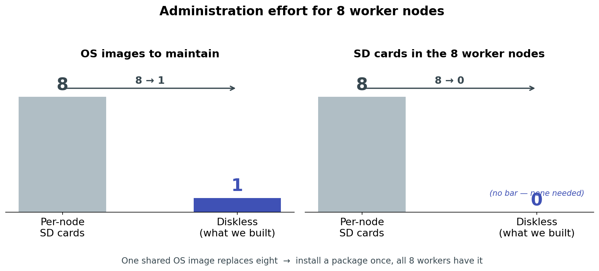
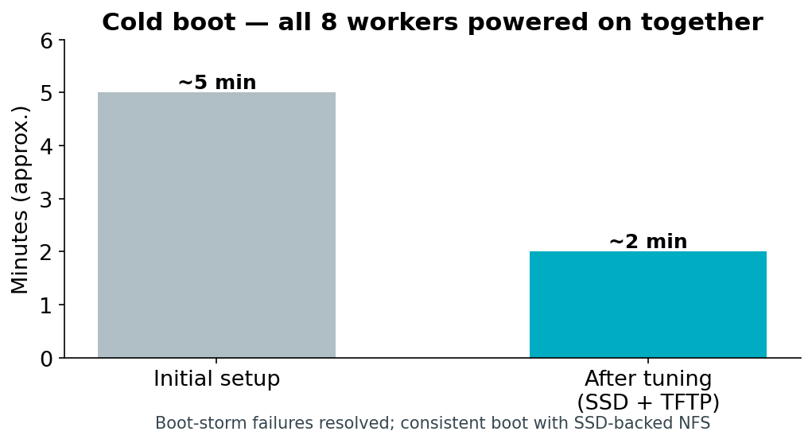
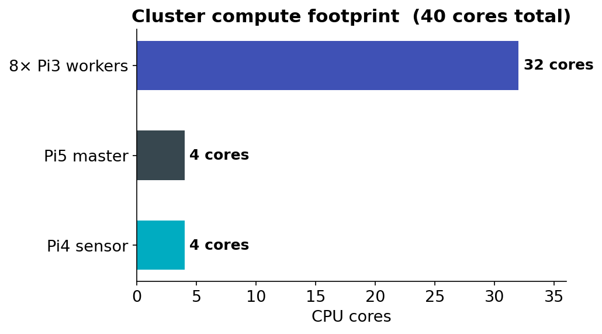

# Task 1 — Infrastructure & Sensor Node Setup

This page documents the foundational infrastructure of our edge computing monitoring solution: a diskless Raspberry Pi cluster with network boot, a shared operating system image, automatic time synchronization, and a sensor node that performs on-camera object detection and streams detection events to the cluster.

The goal of Task 1 was to design and build a reproducible hardware and software platform on which all later tasks (benchmarking, MPI, monitoring, model training, backend, frontend, and notifications) are deployed.

---

## 1. Overview

The infrastructure consists of three logical parts:

1. **Master node** — a Raspberry Pi 5 that provides network services (DHCP, TFTP, NFS), acts as the cluster's NTP time source, and hosts the MQTT broker.
2. **Worker nodes** — eight Raspberry Pi 3 boards that boot entirely over the network (no SD cards) from a single shared 64-bit operating system image served by the master.
3. **Sensor node** — a Raspberry Pi 4 with a Raspberry Pi AI Camera (Sony IMX500) that runs object detection on the camera module itself and publishes detection events to the cluster over MQTT.

All devices are connected to a single Gigabit switch on the private subnet `192.168.1.0/24`.

```
                 Edge-Computing Infrastructure (SS2026)

  User / Administrator
         |
         |  (management, SSH)
         v
  +---------------------------------------------------------------+
  |                          Cluster                              |
  |                                                               |
  |   Sensor Node                 Master Node      Worker Nodes   |
  |   +-------------+             +-----------+    +------------+  |
  |   | Pi 4 +      |   MQTT      |  Pi 5     |    | Pi3 #1     |  |
  |   | AI Camera   |-----------> |  Master   |--->| Pi3 #2     |  |
  |   | (IMX500)    |  events     | SD + SSD  |    | ...        |  |
  |   +-------------+             +-----------+    | Pi3 #8     |  |
  |                                               +------------+  |
  +---------------------------------------------------------------+
                    all connected via one Gigabit switch
```

### Device inventory

| Role | Device | Hostname | IP address |
|------|--------|----------|------------|
| Master | Raspberry Pi 5 (SD + SSD) | `pi5-master` | `192.168.1.50` |
| Sensor | Raspberry Pi 4 + AI Camera | `pi4-edge` | `192.168.1.2` |
| Worker 1 | Raspberry Pi 3 (diskless) | `worker1` | `192.168.1.58` |
| Worker 2 | Raspberry Pi 3 (diskless) | `worker2` | `192.168.1.54` |
| Worker 3 | Raspberry Pi 3 (diskless) | `worker3` | `192.168.1.104` |
| Worker 4 | Raspberry Pi 3 (diskless) | `worker4` | `192.168.1.136` |
| Worker 5 | Raspberry Pi 3 (diskless) | `worker5` | `192.168.1.86` |
| Worker 6 | Raspberry Pi 3 (diskless) | `worker6` | `192.168.1.117` |
| Worker 7 | Raspberry Pi 3 (diskless) | `worker7` | `192.168.1.83` |
| Worker 8 | Raspberry Pi 3 (diskless) | `worker8` | `192.168.1.133` |

### Task 1 at a glance

| Metric | Result |
|---|---|
| SD cards on worker nodes | **0** (down from 8) |
| OS images to maintain | **1** shared (down from 8) |
| Architecture | **64-bit** (`aarch64`) on all nodes |
| Worker compute available | **32 cores**, 8 GB RAM total |
| Cold boot, all 8 workers together | **~2 minutes** (from ~5, after tuning) |
| Time sync offset to master | **microsecond-level** |
| Software rollout | install **once** → live on all 8 workers |

---

## 2. Diskless Network Boot (PXE)

Rather than maintaining eight separate SD cards, the worker nodes boot over the network from a single operating system image hosted on the master. This is the consolidation approach the task asked us to investigate: it simplifies administration (one image to patch and update) and demonstrates a realistic HPC-style provisioning model.



### How a worker boots

The Raspberry Pi 3 bootloader is configured to boot from the network. On power-on, each node performs the following sequence, all served by the master:

1. **DHCP** — the node requests an IP address. The master (running `dnsmasq`) replies with a fixed address based on the node's MAC, the gateway, and the location of the TFTP server.
2. **TFTP** — the node downloads its bootloader (`bootcode.bin`), the 64-bit kernel (`kernel8.img`), the device tree, and a per-node `cmdline.txt`.
3. **NFS root mount** — the kernel mounts its root filesystem over NFS from the master, read from the shared image.
4. **Per-node overlay mount** — a startup script mounts each node's private writable directories.

```
Power on Pi3 (no SD card)
   |
   |-- DHCP request --------------> dnsmasq replies (IP, gateway, TFTP server)
   |-- TFTP download -------------> bootcode.bin, kernel8.img, dtb, cmdline.txt
   |-- NFS mount / --------------> /nfs/rootfs64  (shared OS image)
   |-- mount /etc /var /home -----> /nfs/nodes/<serial>/  (per-node, writable)
   v
Worker is up, SSH reachable
```

### Shared root + per-node overlays

The central design decision is the split between **shared** and **per-node** storage. All nodes share a single OS image, but each node has its own writable system directories so they don't conflict.

| Mount point | Source on master | Mode | Shared? |
|-------------|------------------|------|---------|
| `/` (root) | `/nfs/rootfs64` | read-write | Shared by all nodes |
| `/etc` | `/nfs/nodes/<serial>/etc` | read-write | Per-node |
| `/var` | `/nfs/nodes/<serial>/var` | read-write | Per-node |
| `/home` | `/nfs/nodes/<serial>/home` | read-write | Per-node |
| `/tmp` | `tmpfs` (RAM) | read-write | Per-node, volatile |

This is the standard HPC pattern: one operating system, many machines, each with private configuration and state. Installing software once on the master's shared image makes it instantly available to all eight workers.

> **Node identity.** Each Raspberry Pi 3 is identified by its hardware serial number (the last 8 hex digits, e.g. `a7b7e022`). The master keeps one directory per serial under `/nfs/nodes/` and one boot directory per serial under `/nfs/boot64/`, so each node receives its own hostname and private storage while sharing the same OS.

### Physical storage: SD card + SSD

The master's storage is split across two physical devices:

| Device | Holds |
|--------|-------|
| **SD card** (master) | The master's own OS, plus the shared worker image `/nfs/rootfs64` and the boot files `/nfs/boot64` |
| **SSD** (master) | The per-node private storage `/nfs/nodes/<serial>/` — every worker's `/etc`, `/var` and `/home` |

**Why the per-node directories live on the SSD.** The shared image is mostly read; the per-node directories are where all eight workers *write* continuously — logs, service state, temporary files, caches. Concentrating eight nodes' worth of small random writes on an SD card would be both slow and hard on the card's limited write endurance. Moving that write-heavy traffic to an SSD gives markedly better random-write performance and endurance, and keeps the wear off the card that holds the operating system image.

### Directory layout on the master

```
SD card
└── /nfs/
    ├── rootfs64/            Shared 64-bit OS image (mounted as / by all workers)
    └── boot64/              Network boot files
        ├── bootcode.bin     First-stage bootloader
        ├── kernel8.img      64-bit kernel
        ├── cmdline.txt      Default kernel command line
        └── <serial>/        Per-node boot directory
            └── cmdline.txt  Per-node kernel command line (sets hostname)

SSD
└── /nfs/nodes/
    └── <serial>/            Per-node private, writable storage
        ├── etc/             Node's /etc
        ├── var/             Node's /var
        └── home/            Node's /home
```

### Boot reliability

Powering on all eight workers at the same time initially failed intermittently: the concurrent burst of TFTP requests and NFS mounts overwhelmed the master, and some nodes gave up before completing the transfer. This was resolved by moving TFTP to a dedicated server, raising the NFS thread count, and enlarging the kernel network buffers on the master.



The full cluster now cold-boots **reliably in roughly two minutes**.

---

## 3. Network Services on the Master

A single `dnsmasq` instance on the master provides both DHCP and the boot information the nodes need. NFS exports the shared image and the per-node directories. A separate TFTP daemon serves the boot files.

### DHCP and boot configuration (`dnsmasq`)

Key points of the configuration:

- DNS is disabled (`port=0`) — `dnsmasq` is used only for DHCP and PXE.
- Each worker is pinned to a fixed IP by MAC address, so addresses are predictable and stable across reboots.
- DHCP option 66 and the boot filename direct each node to the master's TFTP service.

```ini
port=0
interface=eth0
bind-dynamic

dhcp-range=192.168.1.50,192.168.1.150,255.255.255.0,12h
dhcp-option=3,192.168.1.50          # gateway
dhcp-option=66,192.168.1.50         # TFTP server address
dhcp-boot=bootcode.bin,pxeserver,192.168.1.50

# Fixed address per worker (MAC -> IP -> hostname)
dhcp-host=b8:27:eb:b7:e0:22,192.168.1.58,worker1
dhcp-host=b8:27:eb:90:0a:eb,192.168.1.54,worker2
# ... one line per worker
```

### NFS exports

The shared root and each per-node directory are exported to the cluster subnet.

```
/nfs/rootfs64        192.168.1.0/24(rw,sync,no_subtree_check,no_root_squash)
/nfs/boot64          192.168.1.0/24(ro,sync,no_subtree_check,no_root_squash)
/nfs/nodes/<serial>  192.168.1.0/24(rw,sync,no_subtree_check,no_root_squash)
```

### Compute available to later tasks

The eight workers together provide the parallel compute fabric that Tasks 2, 3, 4 and 7 run on.



---

## 4. Time Synchronization

Network booting is sensitive to clock errors: if the master's clock is in the past, freshly downloaded files can appear to have modification times "in the future," and logging and TLS misbehave. We therefore made reliable, automatic time synchronization part of the infrastructure.

We use **chrony** in a two-tier arrangement:

- The **master** synchronizes its clock from public internet NTP servers (when online) and serves time to the cluster subnet. It is configured to serve time even before it has reached the internet, so the cluster always has a reference.
- Each **worker** synchronizes from the master rather than the internet. This keeps all nodes consistent with each other even when the cluster has no external connectivity, which is the normal state for an edge deployment.

```
Internet NTP pool
       |
       v
   Pi 5 master  (chrony server, time source for the cluster)
       |
       +--> worker1 ... worker8   (chrony clients, sync from master)
```

The master's timezone is set to `Europe/Berlin`. On boot, each worker starts chrony and performs an immediate step correction, so its clock is correct before any time-sensitive service starts. Measured offset between a worker and the master is at the **microsecond level**.

---

## 5. Sensor Node

The sensor node is a Raspberry Pi 4 with a Raspberry Pi AI Camera built around the Sony IMX500 image sensor. The IMX500 runs a neural network **on the camera module itself**, so object detection happens at the edge without loading the Pi 4's CPU with inference.

### Connection

The sensor node is wired to the same switch as the rest of the cluster and sits on the private subnet at `192.168.1.2`. Keeping the sensor on the local network — rather than connecting it remotely over the internet — is the essence of edge computing: detection happens close to the data source, and only compact event messages travel across the network.

### Detection and event publishing

A service on the Pi 4 runs the camera with an on-sensor object detection model and filters the camera's output so that only meaningful detections are published. For every frame in which one or more objects are detected, the node publishes a small structured JSON message to the cluster's MQTT broker.

```
Raspberry Pi AI Camera (IMX500)
   |  on-sensor object detection
   v
Pi 4 sensor service
   |  filters out empty frames and camera debug output
   |  builds a JSON event with node, timestamp, object count
   v
MQTT publish  ->  topic: cluster/camera/events  ->  broker on Pi 5 (port 1883)
```

A published event looks like this:

```json
{
  "node": "pi4-edge",
  "timestamp": "2026-05-07T15:39:41Z",
  "objects": 1
}
```

### Why MQTT

MQTT was chosen for sensor-to-cluster communication because it is a lightweight publish/subscribe protocol designed for exactly this kind of frequent, small-message telemetry. The sensor node simply publishes events; any number of consumers on the cluster (the event store, the alerting service, the frontend) can subscribe to the same topic independently. This decouples the sensor from whatever processes its data and makes it straightforward to add more sensor nodes later — each one publishes to the same topic.

The MQTT broker (Mosquitto) runs on the master, listens on the standard port `1883`, and accepts connections from the cluster subnet.

### Reliability

The sensor logic runs as a **systemd service**, so it starts automatically when the Pi 4 boots and restarts automatically if it fails. This makes the sensor node true unattended infrastructure rather than something an operator has to launch by hand — it was verified to resume publishing automatically after a power cycle.

---

## 6. End-to-End Data Flow

Putting the pieces together, the complete Task 1 flow is:

```
  AI Camera (IMX500, on-sensor detection)
        |
        v
  Pi 4 sensor node  --- MQTT: cluster/camera/events --->  Pi 5 master (broker)
                                                                |
                                                                |  (consumed by later tasks:
                                                                |   backend storage, Telegram
                                                                |   alerts, frontend map/log)
                                                                v
  Pi 5 master  --- DHCP / TFTP / NFS / NTP --->  8x Pi 3 workers (diskless, 64-bit)
```

The master is the hub: it boots and feeds the workers, sources and serves time, and receives detection events from the sensor. The workers form the compute fabric for later tasks (benchmarking, MPI, containerized backend/frontend). The sensor produces the event stream the whole system exists to act on.

---

## 7. Verification

The infrastructure can be checked at any time with the following commands.

**Connect to the machines:**

```bash
ssh cc123@192.168.1.50     # master (Pi 5)
ssh pi@192.168.1.58        # a worker (Pi 3)
ssh cc123@192.168.1.2      # sensor node (Pi 4)
```

**All eight workers are reachable:**

```bash
for IP in 192.168.1.58 192.168.1.54 192.168.1.104 192.168.1.136 \
          192.168.1.86 192.168.1.117 192.168.1.83 192.168.1.133; do
  ping -c1 -W2 $IP >/dev/null && echo "$IP UP" || echo "$IP DOWN"
done
```

**All workers are running 64-bit:**

```bash
for IP in 192.168.1.58 192.168.1.54 192.168.1.104 192.168.1.136 \
          192.168.1.86 192.168.1.117 192.168.1.83 192.168.1.133; do
  ssh pi@$IP "hostname && uname -m"
done
```

Each node should report its hostname and `aarch64` (64-bit ARM).

**Shared storage is mounted by the nodes** (run on the master):

```bash
sudo showmount -a        # lists nodes currently mounting the NFS exports
sudo exportfs -v         # shows the active exports and their options
```

**Time is synchronized across the cluster:**

```bash
# On the master:
chronyc tracking         # confirms the master is synced to an NTP source
chronyc clients          # lists the workers syncing from it

# On a worker:
chronyc tracking         # Reference ID should be the master (192.168.1.50)
```

**Sensor events are flowing** (run on the master):

```bash
mosquitto_sub -h localhost -t 'cluster/camera/events' -v
```

With an object in view of the camera, structured JSON events appear on this subscription.

**Run any command across all workers:**

```bash
for IP in 192.168.1.58 192.168.1.54 192.168.1.104 192.168.1.136 \
          192.168.1.86 192.168.1.117 192.168.1.83 192.168.1.133; do
  ssh pi@$IP "uptime"
done
```

---

## 8. Outcome and Limitations

**What Task 1 delivers:**

- Eight diskless Raspberry Pi 3 workers booting a single shared 64-bit OS image over the network, each with private writable system directories — **zero SD cards** on the workers, **one image** to maintain instead of eight.
- Storage split across the master's SD card (shared image, read-mostly) and an SSD (per-node writable state, write-heavy).
- A master node providing DHCP, TFTP, NFS, NTP and MQTT for the whole cluster.
- Automatic, internet-independent time synchronization across all nodes.
- A sensor node performing on-camera object detection and publishing structured detection events to the cluster, running unattended as a service.
- Reliable cold boot of the whole cluster in roughly two minutes.

**Known limitations carried into later tasks:**

- The current detection events report an **object count** but not the object **class**. Recognizing specific threat categories (e.g. a person, fire, an abandoned object) requires richer detection output and is addressed alongside the custom model work.
- The sensor currently uses a **pre-trained** detection model supplied with the camera. The project requirement to train and deploy our **own** model is a separate task; the infrastructure here is model-agnostic and will accept the custom model once it is converted to the camera's format.
- Continuous detections are published per qualifying frame. A debouncing / rate-limiting step is planned for the backend and alerting tasks to avoid flooding consumers with duplicate events.
- Storage here is **master-served** shared storage, which is the right fit for diskless boot. Genuinely **distributed** storage (MinIO, erasure-coded across nodes) is introduced later, in the backend task.

These limitations are deliberately scoped out of Task 1, which concerns the infrastructure itself; they are taken up by the model-training, backend, and notification tasks.
