# Task 4: Non-MPI Scaling Laws (Task Distributor)

## Overview

This document covers the results and findings of [Task Distributor](https://github.com/christianbaun/task-distributor)
experiments, which we used to demonstrate **Amdahl's Law** and **Gustafson's Law** on our Raspberry Pi cluster.

Task Distributor is a bash-based parallel image rendering tool that splits a POV-Ray
render job across multiple cluster nodes. The scene file used is `blob.pov` — a
built-in POV-Ray mathematical 3D scene (a metaball/blob shape) that ships with the
`povray-examples` package. No custom image is needed; POV-Ray generates the PNG from
the scene description. Each worker renders a horizontal strip of the final image,
making it ideal for demonstrating parallel computing laws.


## Experiment 1: Amdahl's Law — 5 Runs × 6 Workloads

### 200 x 150 — 5 Runs Per Node Configuration

**1 Nodes — 200x150**

| Run | Seq Part 1 | Parallel Part | Seq Part 2 | Total Time |
|-----|-----------|---------------|-----------|------------|
| 1   | 0.012s    | 4.019s        | 0.012s    | 4.043s     |
| 2   | 0.003s    | 2.012s        | 0.006s    | 2.021s     |
| 3   | 0.004s    | 3.020s        | 0.007s    | 3.031s     |
| 4   | 0.004s    | 3.013s        | 0.007s    | 3.024s     |
| 5   | 0.004s    | 3.015s        | 0.005s    | 3.024s     |
| **AVG** | **0.005s** | **3.015s** | **0.007s** | **3.027s** |

**2 Nodes — 200x150**

| Run | Seq Part 1 | Parallel Part | Seq Part 2 | Total Time |
|-----|-----------|---------------|-----------|------------|
| 1   | 0.003s    | 3.018s        | 0.023s    | 3.044s     |
| 2   | 0.003s    | 2.014s        | 0.024s    | 2.041s     |
| 3   | 0.003s    | 2.013s        | 0.022s    | 2.038s     |
| 4   | 0.003s    | 2.013s        | 0.021s    | 2.037s     |
| 5   | 0.003s    | 2.019s        | 0.023s    | 2.045s     |
| **AVG** | **0.003s** | **2.215s** | **0.022s** | **2.240s** |

**4 Nodes — 200x150**

| Run | Seq Part 1 | Parallel Part | Seq Part 2 | Total Time |
|-----|-----------|---------------|-----------|------------|
| 1   | 0.003s    | 2.026s        | 0.023s    | 2.052s     |
| 2   | 0.003s    | 2.030s        | 0.023s    | 2.056s     |
| 3   | 0.003s    | 2.026s        | 0.024s    | 2.053s     |
| 4   | 0.003s    | 2.026s        | 0.031s    | 2.060s     |
| 5   | 0.005s    | 2.033s        | 0.031s    | 2.069s     |
| **AVG** | **0.003s** | **2.028s** | **0.026s** | **2.057s** |

**8 Nodes — 200x150**

| Run | Seq Part 1 | Parallel Part | Seq Part 2 | Total Time |
|-----|-----------|---------------|-----------|------------|
| 1   | 0.003s    | 2.045s        | 0.024s    | 2.072s     |
| 2   | 0.003s    | 2.058s        | 0.041s    | 2.102s     |
| 3   | 0.003s    | 2.050s        | 0.025s    | 2.078s     |
| 4   | 0.003s    | 2.049s        | 0.025s    | 2.077s     |
| 5   | 0.003s    | 2.052s        | 0.035s    | 2.090s     |
| **AVG** | **0.003s** | **2.050s** | **0.030s** | **2.083s** |

**1 Nodes — 400x300**

| Run | Seq Part 1 | Parallel Part | Seq Part 2 | Total Time |
|-----|-----------|---------------|-----------|------------|
| 1   | 0.003s    | 2.009s        | 0.004s    | 2.016s     |
| 2   | 0.003s    | 2.009s        | 0.004s    | 2.016s     |
| 3   | 0.004s    | 3.013s        | 0.005s    | 3.022s     |
| 4   | 0.003s    | 2.009s        | 0.004s    | 2.016s     |
| 5   | 0.003s    | 2.009s        | 0.006s    | 2.018s     |
| **AVG** | **0.003s** | **2.209s** | **0.004s** | **2.216s** |

**2 Nodes — 400x300**

| Run | Seq Part 1 | Parallel Part | Seq Part 2 | Total Time |
|-----|-----------|---------------|-----------|------------|
| 1   | 0.003s    | 3.020s        | 0.047s    | 3.070s     |
| 2   | 0.003s    | 3.017s        | 0.052s    | 3.072s     |
| 3   | 0.003s    | 2.014s        | 0.045s    | 2.062s     |
| 4   | 0.003s    | 3.017s        | 0.048s    | 3.068s     |
| 5   | 0.003s    | 3.016s        | 0.067s    | 3.086s     |
| **AVG** | **0.003s** | **2.816s** | **0.051s** | **2.870s** |

**4 Nodes — 400x300**

| Run | Seq Part 1 | Parallel Part | Seq Part 2 | Total Time |
|-----|-----------|---------------|-----------|------------|
| 1   | 0.004s    | 2.025s        | 0.044s    | 2.073s     |
| 2   | 0.002s    | 2.025s        | 0.045s    | 2.072s     |
| 3   | 0.003s    | 2.036s        | 0.062s    | 2.101s     |
| 4   | 0.004s    | 2.025s        | 0.047s    | 2.076s     |
| 5   | 0.003s    | 3.029s        | 0.068s    | 3.100s     |
| **AVG** | **0.003s** | **2.228s** | **0.053s** | **2.284s** |

**8 Nodes — 400x300**

| Run | Seq Part 1 | Parallel Part | Seq Part 2 | Total Time |
|-----|-----------|---------------|-----------|------------|
| 1   | 0.004s    | 2.043s        | 0.046s    | 2.093s     |
| 2   | 0.003s    | 2.042s        | 0.067s    | 2.112s     |
| 3   | 0.003s    | 2.047s        | 0.052s    | 2.102s     |
| 4   | 0.003s    | 2.044s        | 0.049s    | 2.096s     |
| 5   | 0.003s    | 2.052s        | 0.064s    | 2.119s     |
| **AVG** | **0.003s** | **2.045s** | **0.055s** | **2.103s** |


**1 Nodes — 800x600**

| Run | Seq Part 1 | Parallel Part | Seq Part 2 | Total Time |
|-----|-----------|---------------|-----------|------------|
| 1   | 0.003s    | 4.016s        | 0.007s    | 4.026s     |
| 2   | 0.004s    | 4.015s        | 0.004s    | 4.023s     |
| 3   | 0.003s    | 4.015s        | 0.006s    | 4.024s     |
| 4   | 0.004s    | 4.014s        | 0.005s    | 4.023s     |
| 5   | 0.003s    | 4.014s        | 0.007s    | 4.024s     |
| **AVG** | **0.003s** | **4.014s** | **0.005s** | **4.022s** |

**2 Nodes — 800x600**

| Run | Seq Part 1 | Parallel Part | Seq Part 2 | Total Time |
|-----|-----------|---------------|-----------|------------|
| 1   | 0.003s    | 4.018s        | 0.158s    | 4.179s     |
| 2   | 0.003s    | 4.017s        | 0.122s    | 4.142s     |
| 3   | 0.003s    | 4.018s        | 0.121s    | 4.142s     |
| 4   | 0.003s    | 3.018s        | 0.156s    | 3.177s     |
| 5   | 0.003s    | 3.020s        | 0.122s    | 3.145s     |
| **AVG** | **0.003s** | **3.618s** | **0.135s** | **3.756s** |

**4 Nodes — 800x600**

| Run | Seq Part 1 | Parallel Part | Seq Part 2 | Total Time |
|-----|-----------|---------------|-----------|------------|
| 1   | 0.003s    | 3.027s        | 0.126s    | 3.156s     |
| 2   | 0.004s    | 3.029s        | 0.153s    | 3.186s     |
| 3   | 0.003s    | 3.030s        | 0.127s    | 3.160s     |
| 4   | 0.003s    | 3.027s        | 0.148s    | 3.178s     |
| 5   | 0.003s    | 3.031s        | 0.133s    | 3.167s     |
| **AVG** | **0.003s** | **3.028s** | **0.137s** | **3.168s** |

**8 Nodes — 800x600**

| Run | Seq Part 1 | Parallel Part | Seq Part 2 | Total Time |
|-----|-----------|---------------|-----------|------------|
| 1   | 0.003s    | 3.058s        | 0.167s    | 3.228s     |
| 2   | 0.003s    | 3.052s        | 0.132s    | 3.187s     |
| 3   | 0.003s    | 3.056s        | 0.149s    | 3.208s     |
| 4   | 0.003s    | 3.058s        | 0.132s    | 3.193s     |
| 5   | 0.004s    | 3.059s        | 0.152s    | 3.215s     |
| **AVG** | **0.003s** | **3.056s** | **0.146s** | **3.205s** |

**1 Nodes — 1600x1200**

| Run | Seq Part 1 | Parallel Part | Seq Part 2 | Total Time |
|-----|-----------|---------------|-----------|------------|
| 1   | 0.004s    | 11.032s       | 0.005s    | 11.041s    |
| 2   | 0.003s    | 10.030s       | 0.005s    | 10.038s    |
| 3   | 0.005s    | 9.027s        | 0.005s    | 9.037s     |
| 4   | 0.003s    | 10.029s       | 0.005s    | 10.037s    |
| 5   | 0.003s    | 10.032s       | 0.005s    | 10.040s    |
| **AVG** | **0.003s** | **10.030s** | **0.005s** | **10.038s** |

**2 Nodes — 1600x1200**

| Run | Seq Part 1 | Parallel Part | Seq Part 2 | Total Time |
|-----|-----------|---------------|-----------|------------|
| 1   | 0.003s    | 10.038s       | 0.403s    | 10.444s    |
| 2   | 0.003s    | 8.030s        | 0.355s    | 8.388s     |
| 3   | 0.003s    | 8.030s        | 0.356s    | 8.389s     |
| 4   | 0.003s    | 8.032s        | 0.372s    | 8.407s     |
| 5   | 0.007s    | 8.037s        | 0.389s    | 8.433s     |
| **AVG** | **0.003s** | **8.433s** | **0.375s** | **8.811s** |

**4 Nodes — 1600x1200**

| Run | Seq Part 1 | Parallel Part | Seq Part 2 | Total Time |
|-----|-----------|---------------|-----------|------------|
| 1   | 0.004s    | 6.039s        | 0.442s    | 6.485s     |
| 2   | 0.003s    | 6.037s        | 0.453s    | 6.493s     |
| 3   | 0.003s    | 6.033s        | 0.500s    | 6.536s     |
| 4   | 0.003s    | 6.037s        | 0.479s    | 6.519s     |
| 5   | 0.003s    | 6.037s        | 0.451s    | 6.491s     |
| **AVG** | **0.003s** | **6.036s** | **0.465s** | **6.504s** |

**8 Nodes — 1600x1200**

| Run | Seq Part 1 | Parallel Part | Seq Part 2 | Total Time |
|-----|-----------|---------------|-----------|------------|
| 1   | 0.004s    | 5.061s        | 0.447s    | 5.512s     |
| 2   | 0.003s    | 5.057s        | 0.466s    | 5.526s     |
| 3   | 0.003s    | 5.055s        | 0.496s    | 5.554s     |
| 4   | 0.004s    | 5.054s        | 0.473s    | 5.531s     |
| 5   | 0.004s    | 5.060s        | 0.481s    | 5.545s     |
| **AVG** | **0.003s** | **5.057s** | **0.472s** | **5.532s** |

**1 Nodes — 3200x2400**

| Run | Seq Part 1 | Parallel Part | Seq Part 2 | Total Time |
|-----|-----------|---------------|-----------|------------|
| 1   | 0.003s    | 45.117s       | 0.006s    | 45.126s    |
| 2   | 0.004s    | 51.140s       | 0.010s    | 51.154s    |
| 3   | 0.004s    | 52.158s       | 0.009s    | 52.171s    |
| 4   | 0.004s    | 54.139s       | 0.006s    | 54.149s    |
| 5   | 0.004s    | 53.154s       | 0.012s    | 53.170s    |
| **AVG** | **0.003s** | **51.141s** | **0.008s** | **51.152s** |

**2 Nodes — 3200x2400**

| Run | Seq Part 1 | Parallel Part | Seq Part 2 | Total Time |
|-----|-----------|---------------|-----------|------------|
| 1   | 0.003s    | 31.092s       | 1.223s    | 32.318s    |
| 2   | 0.003s    | 28.080s       | 1.280s    | 29.363s    |
| 3   | 0.003s    | 27.085s       | 1.324s    | 28.412s    |
| 4   | 0.003s    | 29.086s       | 1.143s    | 30.232s    |
| 5   | 0.003s    | 27.076s       | 1.152s    | 28.231s    |
| **AVG** | **0.003s** | **28.483s** | **1.224s** | **29.710s** |

**4 Nodes — 3200x2400**

| Run | Seq Part 1 | Parallel Part | Seq Part 2 | Total Time |
|-----|-----------|---------------|-----------|------------|
| 1   | 0.003s    | 18.063s       | 1.340s    | 19.406s    |
| 2   | 0.003s    | 20.073s       | 1.281s    | 21.357s    |
| 3   | 0.003s    | 18.063s       | 1.303s    | 19.369s    |
| 4   | 0.003s    | 18.068s       | 1.268s    | 19.339s    |
| 5   | 0.003s    | 18.066s       | 1.326s    | 19.395s    |
| **AVG** | **0.003s** | **18.466s** | **1.303s** | **19.772s** |

**8 Nodes — 3200x2400**

| Run | Seq Part 1 | Parallel Part | Seq Part 2 | Total Time |
|-----|-----------|---------------|-----------|------------|
| 1   | 0.003s    | 14.075s       | 1.602s    | 15.680s    |
| 2   | 0.003s    | 13.083s       | 1.875s    | 14.961s    |
| 3   | 0.003s    | 13.080s       | 1.619s    | 14.702s    |
| 4   | 0.003s    | 14.077s       | 1.579s    | 15.659s    |
| 5   | 0.003s    | 13.078s       | 1.599s    | 14.680s    |
| **AVG** | **0.003s** | **13.478s** | **1.654s** | **15.135s** |

**1 Nodes — 6400x4800**

| Run | Seq Part 1 | Parallel Part | Seq Part 2 | Total Time |
|-----|-----------|---------------|-----------|------------|
| 1   | s         | s             | s         | 0.000s     |
| 2   | s         | s             | s         | 0.000s     |
| 3   | s         | s             | s         | 0.000s     |
| 4   | s         | s             | s         | 0.000s     |
| 5   | s         | s             | s         | 0.000s     |
| **AVG** | **0.000s** | **0.000s** | **0.000s** | **0.000s** |

**4 Nodes — 6400x4800**

| Run | Seq Part 1 | Parallel Part | Seq Part 2 | Total Time |
|-----|-----------|---------------|-----------|------------|
| 1   | 0.003s    | 137.411s      | 5.209s    | 142.623s   |
| 2   | 0.003s    | 210.612s      | 4.976s    | 215.591s   |
| 3   | 0.003s    | 135.408s      | 6.615s    | 142.026s   |
| 4   | 0.005s    | 166.494s      | 5.945s    | 172.444s   |
| 5   | 0.005s    | 213.610s      | 4.624s    | 218.239s   |
| **AVG** | **0.003s** | **172.707s** | **5.473s** | **178.183s** |

**8 Nodes — 6400x4800**

| Run | Seq Part 1 | Parallel Part | Seq Part 2 | Total Time |
|-----|-----------|---------------|-----------|------------|
| 1   | 0.003s    | 166.535s      | 6.572s    | 173.110s   |
| 2   | 0.003s    | 92.357s       | 7.702s    | 100.062s   |
| 3   | 0.007s    | 119.410s      | 6.373s    | 125.790s   |
| 4   | 0.006s    | 89.370s       | 7.904s    | 97.280s    |
| 5   | 0.004s    | 182.602s      | 6.804s    | 189.410s   |
| **AVG** | **0.004s** | **130.054s** | **7.071s** | **137.129s** |


### Amdahl's Law — Summary Table (Averages of 5 Runs)

| Workload  | Nodes | Avg Seq 1 | Avg Parallel | Avg Seq 2 | Avg Total Time  | Std Dev | Speedup   | Efficiency |
|---------- |-------|-----------|--------------|-----------|-----------------|---------|-----------|------------|
| 200x150   | 1     | 0.005s    | 3.015s       | 0.007s    | 3.027s          | ±0.71s  | 1.00x     | 100%       |
| 200x150   | 2     | 0.003s    | 2.215s       | 0.022s    | 2.240s          | ±0.45s  | **1.35x** | 68%        |
| 200x150   | 4     | 0.003s    | 2.028s       | 0.026s    | 2.057s          | ±0.01s  | **1.47x** | 37%        |
| 200x150   | 8     | 0.003s    | 2.050s       | 0.030s    | 2.083s          | ±0.01s  | **1.45x** | 18%        |
| 400x300   | 1     | 0.003s    | 2.209s       | 0.004s    | 2.216s          | ±0.45s  | 1.00x     | 100%       |
| 400x300   | 2     | 0.003s    | 2.816s       | 0.051s    | 2.870s          | ±0.45s  | **0.77x** | 39%        |
| 400x300   | 4     | 0.003s    | 2.228s       | 0.053s    | 2.284s          | ±0.46s  | **0.97x** | 24%        |
| 400x300   | 8     | 0.003s    | 2.045s       | 0.055s    | 2.103s          | ±0.01s  | **1.05x** | 13%        |
| 800x600   | 1     | 0.003s    | 4.014s       | 0.005s    | 4.022s          | ±0.00s  | 1.00x     | 100%       |
| 800x600   | 2     | 0.003s    | 3.618s       | 0.135s    | 3.756s          | ±0.54s  | **1.07x** | 54%        |
| 800x600   | 4     | 0.003s    | 3.028s       | 0.137s    | 3.168s          | ±0.01s  | **1.27x** | 32%        |
| 800x600   | 8     | 0.003s    | 3.056s       | 0.146s    | 3.205s          | ±0.02s  | **1.26x** | 16%        |
| 1600x1200 | 1     | 0.003s    | 10.030s      | 0.005s    | 10.038s         | ±0.71s  | 1.00x     | 100%       |
| 1600x1200 | 2     | 0.003s    | 8.433s       | 0.375s    | 8.811s          | ±0.91s  | **1.14x** | 57%        |
| 1600x1200 | 4     | 0.003s    | 6.036s       | 0.465s    | 6.504s          | ±0.02s  | **1.54x** | 39%        |
| 1600x1200 | 8     | 0.003s    | 5.057s       | 0.472s    | 5.532s          | ±0.02s  | **1.81x** | 23%        |
| 2000x1504 | 8     | N/A       | N/A          | N/A       | 8.366s          | ±0.54s  | N/A       | N/A        |
| 3200x2400 | 1     | 0.003s    | 51.141s      | 0.008s    | 51.152s         | ±3.55s  | 1.00x     | 100%       |
| 3200x2400 | 2     | 0.003s    | 28.483s      | 1.224s    | 29.710s         | ±1.66s  | **1.72x** | 86%        |
| 3200x2400 | 4     | 0.003s    | 18.466s      | 1.303s    | 19.772s         | ±0.89s  | **2.59x** | 65%        |
| 3200x2400 | 8     | 0.003s    | 13.478s      | 1.654s    | 15.135s         | ±0.50s  | **3.38x** | 42%        |
| 6400x4800 | 1     | 0.000s    | 0.000s       | 0.000s    | 0.000s          | ±0.00s  | N/A       | N/A        |
| 6400x4800 | 4     | 0.003s    | 172.707s     | 5.473s    | 178.183s        | ±37.45s | N/A       | N/A        |
| 6400x4800 | 8     | 0.004s    | 130.054s     | 7.071s    | 137.129s        | ±42.19s | N/A       | N/A        |


**Key insight:** With smaller image size adding more nodes give diminishing or worse performance returns (e.g. 200x150 - [2, 4, 8]) probably because of the NFS overhead.


### Amdahl's Law — Graphs
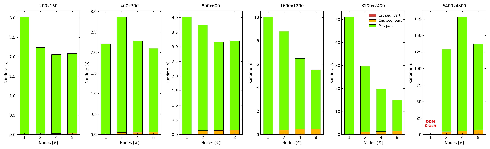 
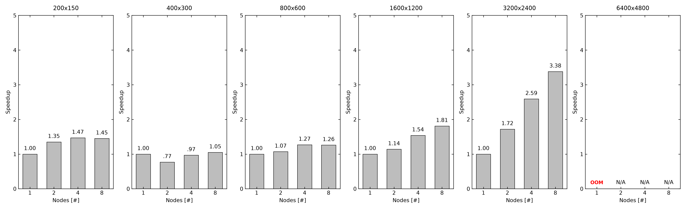 
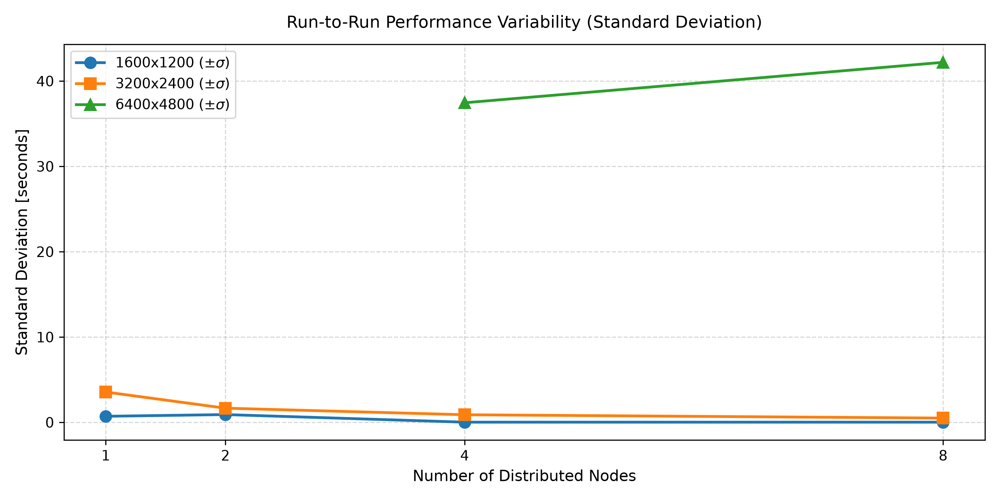 

---

## Experiment 2: Gustafson's Law

### Theory

Gustafson's Law addresses Amdahl's pessimism by noting that in practice, larger
problems benefit more from parallelism:

```
Scaled Speedup(N) = N - S × (N - 1)
```

**Approach:** Scale the image size proportionally with the number of nodes, keeping
the work per node constant (each node always renders 120 rows).

| Nodes | Image Size | Rows per Node |
|-------|-----------|---------------|
| 1     | 160×120   | 120 rows      |
| 2     | 160×240   | 120 rows each |
| 4     | 160×480   | 120 rows each |
| 8     | 160×960   | 120 rows each |


### Single-Run Results (Empirical — Measured on Physical Cluster)

| Nodes | Image Size | Seq Part 1 | Parallel Part | Seq Part 2 | Total Time |
|-------|-----------|-----------|---------------|-----------|------------|
| 1     | 160×120   | 0.004s    | 3.014s        | 0.006s    | 3.024s     |
| 2     | 160×240   | 0.004s    | 3.019s        | 0.034s    | 3.057s     |
| 4     | 160×480   | 0.004s    | 3.030s        | 0.044s    | 3.078s     |
| 8     | 160×960   | 0.004s    | 4.063s        | 0.088s    | 4.155s     |

---

## Experiment 2: Gustafson's Law — 5 Runs x Workfload Set 1

### 1600x600 / node Base — 5 Runs


**1 Nodes — 1600x600**

| Run | Seq Part 1 | Parallel Part | Seq Part 2 | Total Time |
|-----|-----------|---------------|-----------|------------|
| 1   | 0.006s    | 7.025s        | 0.010s    | 7.041s     |
| 2   | 0.004s    | 6.021s        | 0.006s    | 6.031s     |
| 3   | 0.004s    | 5.018s        | 0.006s    | 5.028s     |
| 4   | 0.004s    | 5.018s        | 0.005s    | 5.027s     |
| 5   | 0.003s    | 5.019s        | 0.006s    | 5.028s     |
| **AVG** | **0.004s** | **5.620s** | **0.006s** | **5.630s** |

**2 Nodes — 1600x1200**

| Run | Seq Part 1 | Parallel Part | Seq Part 2 | Total Time |
|-----|-----------|---------------|-----------|------------|
| 1   | 0.003s    | 10.038s       | 0.403s    | 10.444s    |
| 2   | 0.003s    | 8.028s        | 0.359s    | 8.390s     |
| 3   | 0.003s    | 8.029s        | 0.392s    | 8.424s     |
| 4   | 0.003s    | 8.042s        | 0.431s    | 8.476s     |
| 5   | 0.003s    | 7.030s        | 0.354s    | 7.387s     |
| **AVG** | **0.003s** | **8.233s** | **0.387s** | **8.623s** |

**4 Nodes — 3200x1200**

| Run | Seq Part 1 | Parallel Part | Seq Part 2 | Total Time |
|-----|-----------|---------------|-----------|------------|
| 1   | 0.003s    | 11.051s       | 0.729s    | 11.783s    |
| 2   | 0.003s    | 9.048s        | 0.787s    | 9.838s     |
| 3   | 0.003s    | 9.050s        | 0.830s    | 9.883s     |
| 4   | 0.003s    | 9.046s        | 0.775s    | 9.824s     |
| 5   | 0.005s    | 9.050s        | 0.740s    | 9.795s     |
| **AVG** | **0.003s** | **9.449s** | **0.772s** | **10.224s** |

**8 Nodes — 3200x2400**

| Run | Seq Part 1 | Parallel Part | Seq Part 2 | Total Time |
|-----|-----------|---------------|-----------|------------|
| 1   | 0.004s    | 16.087s       | 1.692s    | 17.783s    |
| 2   | 0.004s    | 15.090s       | 1.600s    | 16.694s    |
| 3   | 0.007s    | 16.110s       | 1.605s    | 17.722s    |
| 4   | 0.003s    | 14.079s       | 1.701s    | 15.783s    |
| 5   | 0.003s    | 13.082s       | 1.644s    | 14.729s    |
| **AVG** | **0.004s** | **14.889s** | **1.648s** | **16.541s** |


### Gustafson's Law (Set 1) — Summary Table (Averages of 5 Runs)

| Size      | Nodes | Avg Seq 1 | Avg Parallel | Avg Seq 2 | Avg Total Time  | Std Dev | Scaled Speedup  | Efficiency |
|---------- |-------|-----------|--------------|-----------|-----------------|---------|-----------------|------------|
| 1600x600  | 1     | 0.004s    | 5.620s       | 0.006s    | 5.630s          | ±0.90s  | 1.00x           | 100%       |
| 1600x1200 | 2     | 0.003s    | 8.233s       | 0.387s    | 8.623s          | ±1.11s  | **1.95x**       | 98%        |
| 3200x1200 | 4     | 0.003s    | 9.449s       | 0.772s    | 10.224s         | ±0.87s  | **3.77x**       | 94%        |
| 3200x2400 | 8     | 0.004s    | 14.889s      | 1.648s    | 16.541s         | ±1.31s  | **7.30x**       | 91%        |


### Gustafson's Law (Set 1) — Graphs

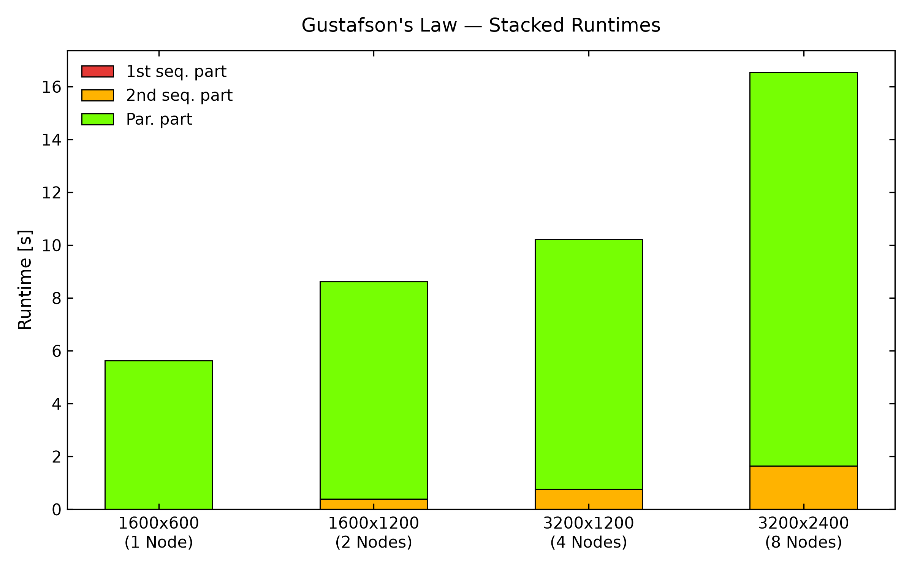 
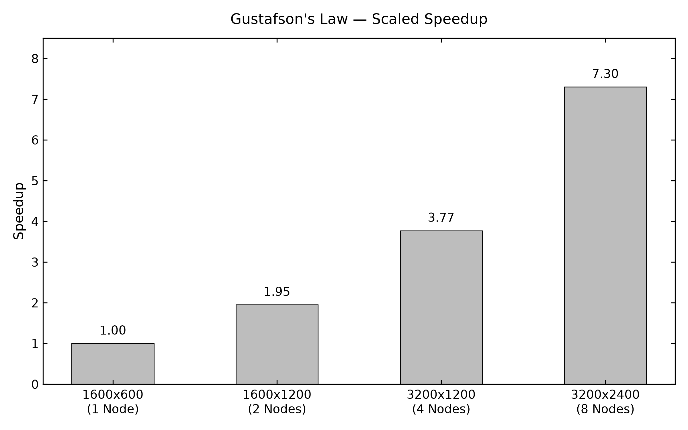 
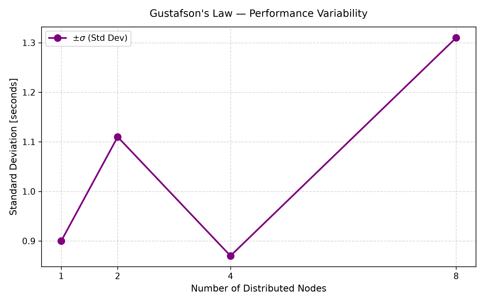


## Experiment 2: Gustafson's Law — 5 Runs x Workfload Set 2

**1 Nodes — 3200x1200**

| Run | Seq Part 1 | Parallel Part | Seq Part 2 | Total Time |
|-----|-----------|---------------|-----------|------------|
| 1   | 0.005s    | 15.042s       | 0.006s    | 15.053s    |
| 2   | 0.004s    | 15.041s       | 0.004s    | 15.049s    |
| 3   | 0.003s    | 14.041s       | 0.007s    | 14.051s    |
| 4   | 0.004s    | 14.043s       | 0.004s    | 14.051s    |
| 5   | 0.004s    | 14.041s       | 0.004s    | 14.049s    |
| **AVG** | **0.004s** | **14.441s** | **0.005s** | **14.450s** |

**2 Nodes — 3200x2400**

| Run | Seq Part 1 | Parallel Part | Seq Part 2 | Total Time |
|-----|-----------|---------------|-----------|------------|
| 1   | 0.003s    | 27.088s       | 1.204s    | 28.295s    |
| 2   | 0.003s    | 30.085s       | 1.143s    | 31.231s    |
| 3   | 0.003s    | 27.075s       | 1.127s    | 28.205s    |
| 4   | 0.003s    | 27.078s       | 1.162s    | 28.243s    |
| 5   | 0.003s    | 27.085s       | 1.180s    | 28.268s    |
| **AVG** | **0.003s** | **27.682s** | **1.163s** | **28.848s** |


**4 Nodes — 4800x2400**

| Run | Seq Part 1 | Parallel Part | Seq Part 2 | Total Time |
|-----|-----------|---------------|-----------|------------|
| 1   | 0.003s    | 29.099s       | 1.631s    | 30.733s    |
| 2   | 0.002s    | 27.090s       | 1.630s    | 28.722s    |
| 3   | 0.002s    | 27.096s       | 1.654s    | 28.752s    |
| 4   | 0.002s    | 27.088s       | 1.700s    | 28.790s    |
| 5   | 0.003s    | 27.091s       | 1.661s    | 28.755s    |
| **AVG** | **0.002s** | **27.492s** | **1.655s** | **29.149s** |

**8 Nodes — 6400x4800**

| Run | Seq Part 1 | Parallel Part | Seq Part 2 | Total Time |
|-----|-----------|---------------|-----------|------------|
| 1   | 0.003s    | 166.535s      | 6.572s    | 173.110s   |
| 2   | 0.003s    | 92.357s       | 7.702s    | 100.062s   |
| 3   | 0.007s    | 119.410s      | 6.373s    | 125.790s   |
| 4   | 0.006s    | 89.370s       | 7.904s    | 97.280s    |
| 5   | 0.004s    | 182.602s      | 6.804s    | 189.410s   |
| **AVG** | **0.004s** | **130.054s** | **7.071s** | **137.129s** |


### Gustafson's Law (Set 2) — Summary Table (Averages of 5 Runs)

| Size      | Nodes | Avg Seq 1 | Avg Parallel | Avg Seq 2 | Avg Total Time  | Std Dev | Scaled Speedup  | Efficiency |
|---------- |-------|-----------|--------------|-----------|-----------------|---------|-----------------|------------|
| 3200x1200 | 1     | 0.004s    | 14.441s      | 0.005s    | 14.450s         | ±0.55s  | 1.00x           | 100%       |
| 3200x2400 | 2     | 0.003s    | 27.682s      | 1.163s    | 28.848s         | ±1.33s  | **1.96x** | 98%        |
| 4800x2400 | 4     | 0.002s    | 27.492s      | 1.655s    | 29.149s         | ±0.89s  | **3.83x** | 96%        |
| 6400x4800 | 8     | 0.004s    | 130.054s     | 7.071s    | 137.129s        | ±42.19s | **7.64x** | 95%        |


### Gustafson's Law (Set 2) — Graphs
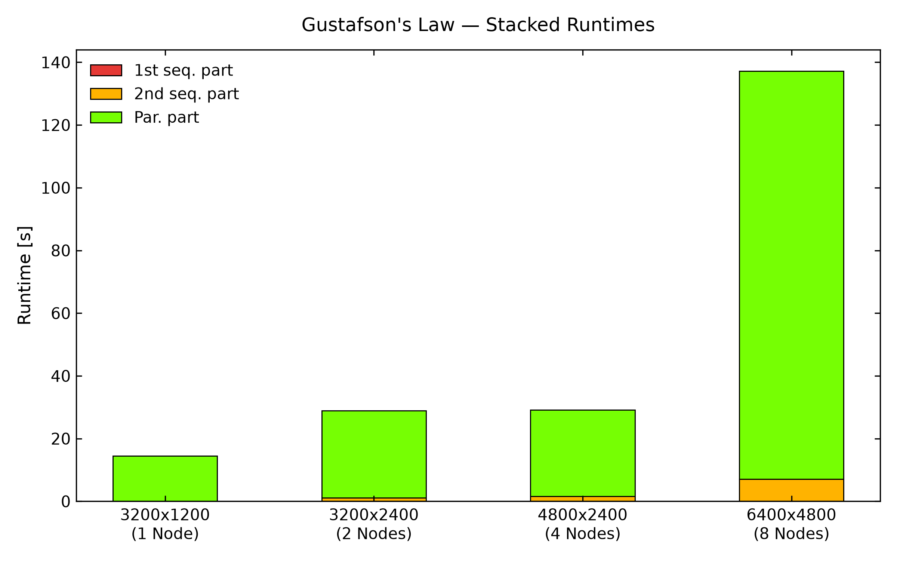 
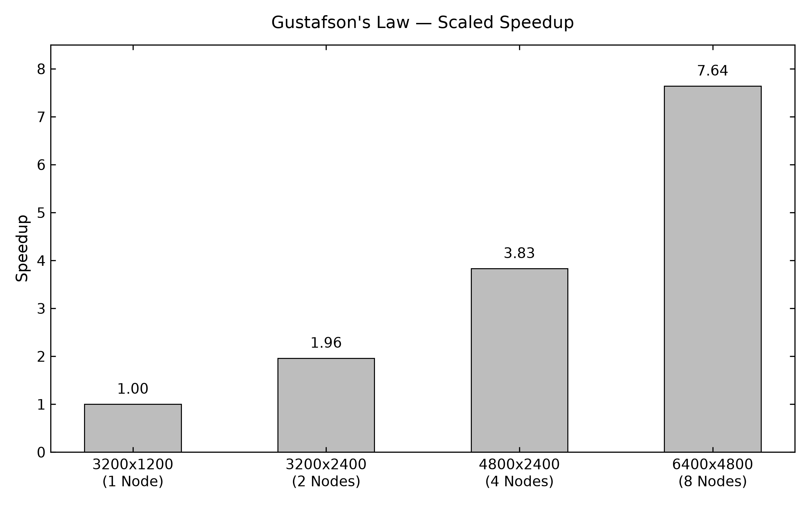 
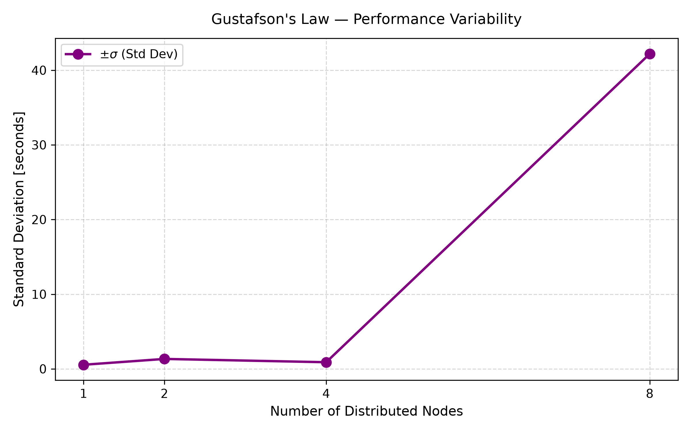 


**Key insight:** Gustafson's Law is confirmed — as workload scales with node
count, each node processes the same amount of data in approximately the same
time, while total throughput scales nearly linearly with node count.

---

**Combined conclusion:** For small fixed tasks, parallelism overhead dominates
(Amdahl). For large scalable tasks, distributed computing delivers near-linear
throughput scaling (Gustafson). Both perspectives together give a complete
picture of parallel computing on real hardware.

---

## Troubleshooting Reference

| Problem | Cause | Fix |
|---------|-------|-----|
| `ssh: No route to host` | Workers not booted | Follow golden boot sequence |
| `Could not resolve hostname pi110` | Hardcoded hostnames in script | Update `HOSTS_ARRAY` in master script |
| `lockfile already exists` | Previous run failed | `rm -f workspace_*/lockfile` |
| `Permission denied on workspace` | Workers (pi user) can't write to cc123 folder | `sudo chmod -R 777 /mnt/ssd/nfs/hpl-results/task-distributor/` |
| `convert: command not found` | Wrong ImageMagick binary name | Use `convert-im6.q16` on workers, `convert-im7.q16` on master |
| `Error opening terminal: unknown` | POV-Ray needs TTY | Add `TERM=dumb` before povray command |
| `No such file or directory: blob.png` | POV-Ray not rendering | Check `TERM=dumb` and correct `+I` path |
| `*pi*.png: No such file` | Master looking for wrong filename | Worker writes IP.png not hostname.png |
| Workers write wrong name to lockfile | Script uses `hostname` | Change to `hostname -I \| awk '{print $1}'` |


*Cloud Computing Course SS2026 — Frankfurt University of Applied Sciences*
*Date: July 12, 2026*

## Issues and Fixes
#### Memory issues
These occur for larger image sizes 6400 x 4800 especially if the number of nodes are less. We added a storage space for workers for support via changes to [task-distributor-worker](../../../benchmark/task-distributor-worker.sh). The script uses a storage space for each worker if the size exceeds 3200 x 2400. All the 6400 x H results were obtained after this updated.

#### Unordered composed image
Added a fix where the image composed of image cuts generated by worker hosts produce an unordered image 

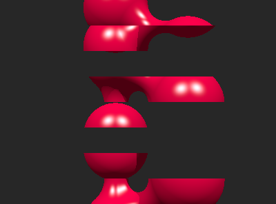
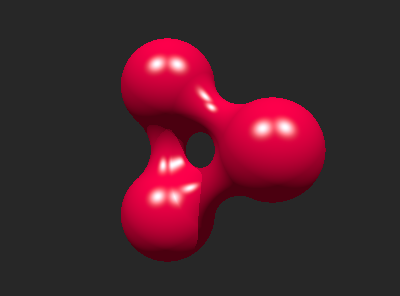


#### Failed runs

#### 5400x2400 / 4 nodes

#### 6400x2400 / 4 nodes

#### 6400x2400 / 4 nodes

