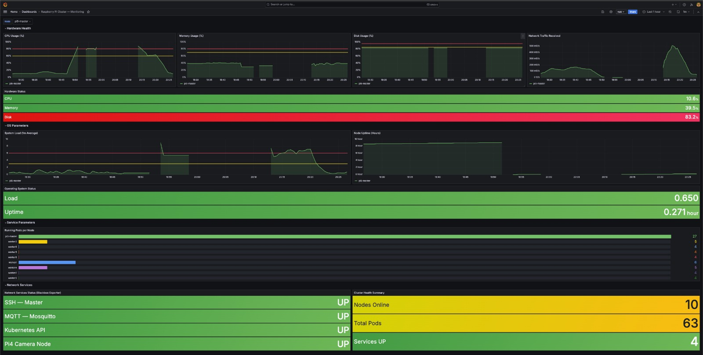

# Task 5 — Cluster Monitoring & Observability

## Overview

This document describes the design and deployment of the centralized monitoring infrastructure for the Raspberry Pi Kubernetes cluster. The objective is to continuously observe the health and performance of the cluster — including hardware resources, Kubernetes resources, and network services — through a single monitoring platform.

The monitoring solution was deployed using the **kube-prometheus-stack** Helm chart, which provides a complete monitoring ecosystem including Prometheus, Alertmanager, Grafana, Node Exporter, kube-state-metrics, the Prometheus Operator, and Blackbox Exporter.

The infrastructure was designed for the following cluster:

| Node | Description |
|------|-------------|
| Raspberry Pi 5 | Kubernetes Master Node (`pi5-master`) |
| Raspberry Pi 3 × 8 | Worker Nodes |
| Raspberry Pi 4 | Edge Camera Node (`pi4-edge`) |

All resource-intensive monitoring components were deployed on the Raspberry Pi 5 master node, while lightweight monitoring agents were distributed across the worker nodes.

---

## Objectives

- Deploy a centralized monitoring platform for the Kubernetes cluster.
- Monitor hardware resources: CPU, memory, filesystem, and network usage.
- Monitor Kubernetes resources: nodes, pods, and deployments.
- Monitor network service availability across the cluster.
- Provide real-time visualization through Grafana dashboards.
- Minimize resource usage on worker nodes.

---


## 1. Monitoring Architecture & Resource Optimization

The Raspberry Pi 3 worker nodes have only **1 GB of RAM** and boot diskless over NFS. Running heavy monitoring services on every worker would degrade cluster performance and reduce resources available for application workloads.

To address this, the monitoring system follows a **centralized architecture**: all resource-intensive services run exclusively on the Raspberry Pi 5 master node, while lightweight Node Exporter agents run on every Kubernetes cluster node.

The Raspberry Pi 4 camera node is not part of the Kubernetes cluster. It is monitored as an external network service using Blackbox Exporter.

---

### Architecture Diagram

```text
+------------------+     +------------------+     +------------------+
|   Worker Node 1  |     |   Worker Node 2  |     |   Worker Node N  |
|  Node Exporter   |     |  Node Exporter   |     |  Node Exporter   |
+--------+---------+     +--------+---------+     +--------+---------+
         |                        |                        |
         +------------------------+------------------------+
                                  |
                                  | Hardware & OS Metrics
                                  |
                                  v
  kube-state-metrics  -------->  Prometheus  <-------- Blackbox Exporter
  (Kubernetes Objects)       (pi5-master)          (Network Probes)
                                  |
                         managed by Prometheus Operator
                                  |
                    +-------------+-------------+
                    |                           |
                    v                           v
             +------+------+          +---------+--------+
             |    Grafana   |          |   Alertmanager   |
             | (Visualize   |          | (Receive, Group, |
             |   Metrics)   |          |  Route Alerts)   |
             +--------------+          +------------------+
```

Grafana only visualizes data stored in Prometheus. Alertmanager receives alert events forwarded by Prometheus and is responsible for grouping and routing them.

---

### Central Monitoring Components (Master Node)

The following services are pinned to `pi5-master` using Kubernetes `nodeSelector`:

- Prometheus
- Alertmanager
- Grafana
- Prometheus Operator
- kube-state-metrics
- Blackbox Exporter

The Raspberry Pi 5 provides significantly more processing power and uses a local SSD, making it well suited to host these services without impacting the worker nodes.

---

### Worker Monitoring Components

Node Exporter runs on the Raspberry Pi 5 master node and on all eight Raspberry Pi 3 worker nodes. It is deployed as a Kubernetes **DaemonSet**, which ensures that exactly one Node Exporter pod is automatically scheduled on every Kubernetes cluster node.

Node Exporter collects:

- CPU utilization
- Memory usage
- Filesystem usage
- Network traffic
- System load
- Operating system information

The Raspberry Pi 4 camera node is outside the Kubernetes cluster and does not run Node Exporter. It is monitored by Blackbox Exporter instead, which checks whether its network services are reachable.

Because Node Exporter has a minimal resource footprint, it continuously monitors each cluster node without affecting NFS boot performance or available RAM.

---

### Kubernetes Scheduling

To ensure monitoring services always run on the master node, Kubernetes **nodeSelector** constraints were configured:

```yaml
nodeSelector:
  kubernetes.io/hostname: pi5-master
```

Without this constraint, Kubernetes could schedule monitoring services onto worker nodes, consuming their limited resources.

---


## 2. Monitoring Components

Each component has a dedicated role within the monitoring pipeline.

---

### 2.1 Helm

Helm is the package manager for Kubernetes. It simplifies the deployment of complex applications by installing all required Kubernetes resources from predefined charts, eliminating the need to manually write multiple YAML files. Helm was used to deploy and manage the monitoring stack while also simplifying upgrades and rollbacks.

```bash
helm install monitoring prometheus-community/kube-prometheus-stack \
  -n monitoring --create-namespace
```

---

### 2.2 kube-prometheus-stack

A pre-configured Helm chart that bundles Prometheus, Alertmanager, Grafana, Node Exporter, kube-state-metrics, and the Prometheus Operator into a single coordinated deployment. Using this chart significantly simplified installation and ensured all components were correctly integrated.

---

### 2.3 Prometheus

The central metrics collection and storage engine. Prometheus periodically scrapes metrics from Node Exporter, kube-state-metrics, and Blackbox Exporter, and stores them in a time-series database. All Grafana dashboards use Prometheus as their data source.

Whenever a Prometheus alert rule is triggered, Prometheus forwards the alert to Alertmanager for further processing and notification routing.

---

### 2.4 Alertmanager

Alertmanager receives alert events forwarded by Prometheus. It is responsible for grouping, managing, and routing alerts to the appropriate notification channels. Alertmanager is deployed as part of the monitoring stack through the kube-prometheus-stack Helm chart and runs on the master node alongside Prometheus. Detailed alert rules, notification policies, and integration configuration are documented separately in Task 9.

---

### 2.5 Prometheus Operator

Manages Prometheus and its configuration as native Kubernetes resources using Custom Resource Definitions (CRDs). It automatically configures scrape targets via **ServiceMonitor** objects and reconciles the Prometheus configuration whenever the cluster state changes.

---

### 2.6 Grafana

The web-based visualization layer. Grafana queries Prometheus using PromQL and renders the results as interactive dashboards containing time-series graphs, bar gauges, and stat panels. Grafana does not collect metrics itself — it only visualizes data stored in Prometheus.

---

### 2.7 Node Exporter

A lightweight agent that reads hardware and OS metrics directly from the Linux kernel (`/proc`, `/sys`) and exposes them on port `9100` for Prometheus to scrape. Deployed as a DaemonSet, it runs on every Kubernetes cluster node — the Raspberry Pi 5 master node and all eight Raspberry Pi 3 worker nodes.

**Node Exporter monitors node hardware and operating system health.**

---

### 2.8 kube-state-metrics

Monitors **Kubernetes object state** by communicating with the Kubernetes API. It exports information about pods, deployments, nodes, and namespaces — metrics that Node Exporter cannot provide. This is the component that powers the "Running Pods per Node" panel in the dashboard.

---

### 2.9 Blackbox Exporter

Performs active TCP probes against configured network service endpoints. It checks whether a service is reachable and reports the result as `probe_success = 1` (UP) or `0` (DOWN).

**Blackbox Exporter monitors network service availability.**

In this project, it monitors:
- SSH on the master node (`192.168.1.50:22`)
- MQTT Broker (`192.168.1.50:1883`)
- Kubernetes API (`192.168.1.50:6443`)
- Pi4 Camera Node (`192.168.1.2:22`)

Unlike Node Exporter, which monitors hardware and operating system metrics on Kubernetes cluster nodes, Blackbox Exporter monitors whether network services are reachable. Since the Raspberry Pi 4 camera is an external edge device and not part of the Kubernetes cluster, it is monitored through Blackbox Exporter rather than Node Exporter.

---

## 3. Troubleshooting & Recovery

During deployment, two significant issues were encountered and resolved.

---

### 3.1 Helm Release Rollback

**Problem:** The `kube-prometheus-stack` Helm release became corrupted during a failed upgrade, leaving custom hooks and service accounts in an inconsistent state and preventing further updates.

**Fix:** The release was rolled back to the last known clean revision:

```bash
helm rollback monitoring 7 -n monitoring
```

**Result:** The release returned to a stable state, allowing the deployment to continue normally.

---

### 3.2 Grafana ImagePullBackOff

**Problem:** Grafana was stuck in `ImagePullBackOff` on `pi5-master`, with a containerd `FailedPrecondition` error indicating a corrupted cached image layer.

**Fix:** The corrupted cache was bypassed by downloading the image via Docker and importing it directly into the K3s containerd namespace:

```bash
docker pull grafana/grafana:10.4.3
docker save grafana/grafana:10.4.3 -o ~/grafana.tar
sudo k3s ctr images import ~/grafana.tar
```

**Result:** Grafana transitioned immediately to `3/3 Running`.

---

## 4. Operational Reference

### Accessing Grafana

Start port-forwarding from the master node:

```bash
kubectl port-forward -n monitoring svc/monitoring-grafana 3000:80 --address 0.0.0.0
```

Open Grafana in a browser:

```
http://192.168.1.50:3000
```

- **Username:** `admin`
- **Password:** Configured securely during deployment
- **Navigation:** Sidebar → Dashboards → select the monitoring dashboard

---

## 5. Grafana Monitoring Dashboard

The custom dashboard **"Raspberry Pi Cluster — Monitoring"** provides a unified view of the entire cluster, organized into five sections:

- **Hardware Health** — Time-series graphs for CPU, Memory, Disk, and Network Traffic with threshold lines, plus a live stat panel showing current values per node.
- **OS Parameters** — System Load (1m average) and Node Uptime graphs with live current values.
- **Service Parameters** — A horizontal bar gauge showing running pod counts per Kubernetes node, sourced from kube-state-metrics.
- **Network Services** — UP/DOWN status for SSH, MQTT, Kubernetes API, and Pi4 Camera via Blackbox Exporter.
- **Cluster Health Summary** — Live counts for Nodes Online, Total Pods, and Services UP.

A node-selection dropdown allows filtering all panels for individual Raspberry Pi nodes.



---

## 6. Conclusion

Task 5 successfully implemented a centralized monitoring infrastructure for the Raspberry Pi Kubernetes cluster. The deployed stack provides:

- **Centralized monitoring and alert management** — all services managed from a single master node.
- **Resource optimization** — lightweight Node Exporter on workers, heavy components on the Pi5 Master.
- **Hardware monitoring** — CPU, memory, disk, and network metrics across all nodes.
- **Kubernetes resource monitoring** — pod counts, deployment status, and node health via kube-state-metrics.
- **Network service monitoring** — real-time UP/DOWN status via Blackbox Exporter.
- **Real-time observability** — unified Grafana dashboard with live metrics and node filtering.

During implementation, a Helm release deadlock and a Grafana image corruption issue were encountered and resolved without data loss or cluster disruption. The monitoring infrastructure provides a stable, practical foundation for observing the operational status of the Raspberry Pi Kubernetes cluster throughout the project lifecycle.
