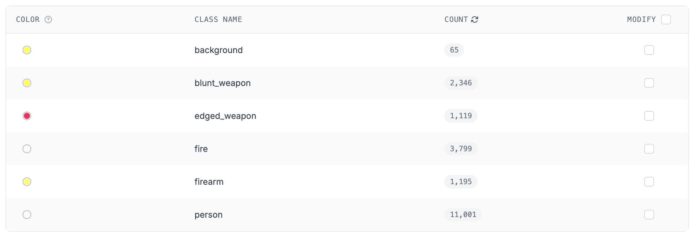
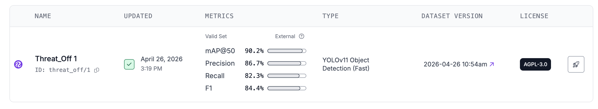
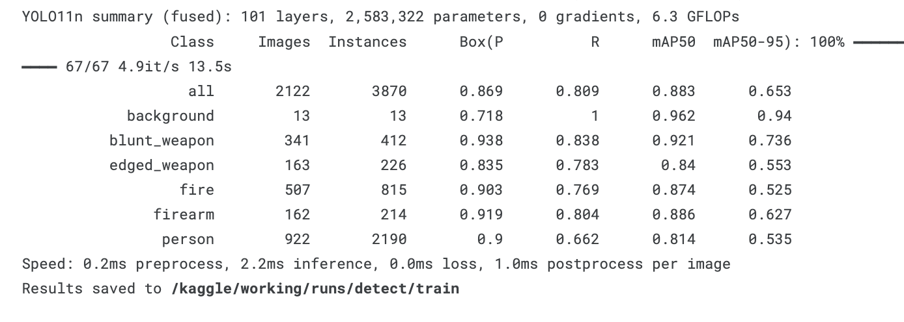
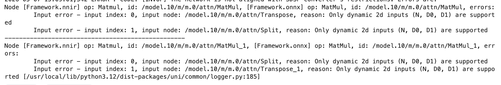
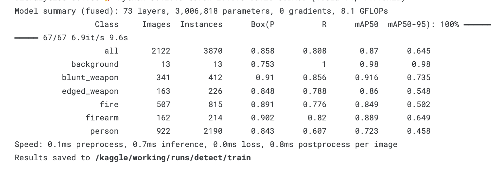
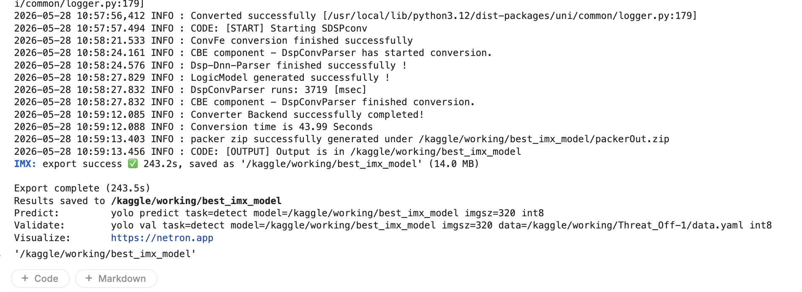
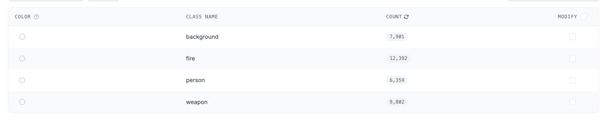
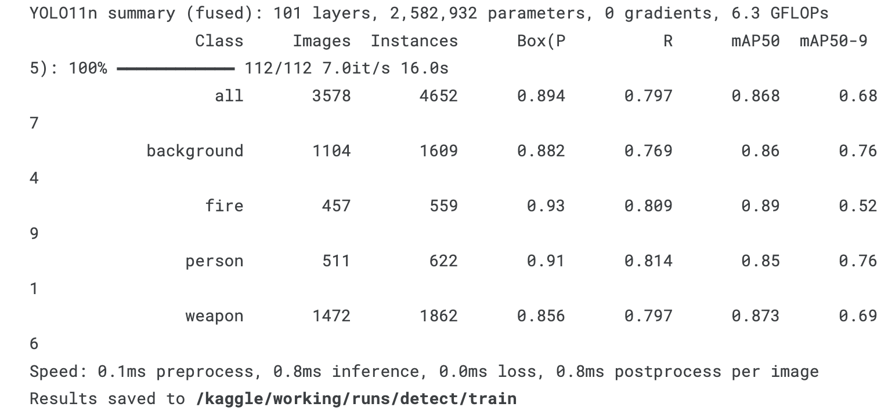

# Task 6 — Model Training & Deployment

Documentation for this task will be added as implementation progresses.

## Objectives

* Collect images for training and testing the object detection model.
* Train a custom model using TensorFlow, OpenCV, or YOLO frameworks.
* Optimize and compile the trained model for hardware-accelerated edge inference on the Raspberry Pi AI Camera (IMX500).

---

## 1. Data Preparation and Augmentation

A custom multi-class dataset was compiled using the Roboflow platform by fusing disparate image sets containing target classes. Preprocessing and structural augmentations were applied globally to improve generalization performance across edge deployments.



---

## 2. Model Selection and Training Experiments

Two distinct architecture variants were chosen to find a pipeline compatible with the Raspberry Pi AI Camera's Sony IMX500 hardware constraints.

### Evaluation Metrics Summary

| Model Framework | Layer Count | Parameters | GFLOPs | Overall mAP50 | Overall mAP50-95 | IMX500 Compilation Status |
| --- | --- | --- | --- | --- | --- | --- |
| **YOLOv11n** | 101 | 2,583,322 | 6.3 | 0.883 | 0.653 | **Failed** (Hardware Layer Incompatibility) |
| **YOLOv8n** | 73 | 3,006,818 | 8.1 | 0.870 | 0.645 | **Successful** (Validated through successful deployment) |

### Experiment 1: YOLOv11n (Roboflow & Kaggle)

Initial training was performed on a YOLOv11n architecture (`yolo/yolo11n.py`). While local optimization converged successfully, compilation to the native edge format failed during the hardware translation step.

```text
YOLO11n summary (fused): 101 layers, 2,583,322 parameters, 0 gradients, 6.3 GFLOPs
Class          Images  Instances      Box(P          R      mAP50  mAP50-95)
all              2122       3870      0.869      0.809      0.883      0.653
background         13         13      0.718          1      0.962       0.94
blunt_weapon      341        412      0.938      0.838      0.921      0.736
edged_weapon      163        226      0.835      0.783       0.84      0.553
fire              507        815      0.903      0.769      0.874      0.525
firearm           162        214      0.919      0.804      0.886      0.627
person            922       2190        0.9      0.662      0.814      0.535

```
#### Roboflow Yollo11n


#### Kaggle Yollo11n



To convert the resulting ONNX graph to the target hardware definition, the following command was executed in Kaggle:

```bash
imxconv-pt -i /kaggle/working/best.onnx -o /kaggle/working/sony_output --no-input-persistency

```

> **Result:** Compilation failed. The YOLOv11n operations layer graph exceeded the complexity bounds supported by the IMX500 hardware compiler toolchain.
> 

### Experiment 2: YOLOv8n (Kaggle)

As a fallback, a legacy YOLOv8n architecture was trained using the same dataset (`yolo/yolo8n.py`). This architecture has mature toolchain support for the target edge processor.

```text
YOLO8n summary (fused): 73 layers, 3,006,818 parameters, 0 gradients, 8.1 GFLOPs
Class          Images  Instances      Box(P          R      mAP50  mAP50-95)
all              2122       3870      0.858      0.808       0.87      0.645
background         13         13      0.753          1       0.98       0.98
blunt_weapon      341        412       0.91      0.856      0.916      0.735
edged_weapon      163        226      0.848      0.788       0.86      0.548
fire              507        815      0.891      0.776      0.849      0.502
firearm           162        214      0.902       0.82      0.889      0.649
person            922       2190      0.843      0.607      0.723      0.458

```



The conversion tool successfully translated the model into individual network hardware components (`cfgA.bin`, `sdpsA.bin`, `manifest.json`, etc.).



### Experiment 3: YOLOv11n (Kaggle larger dataset ~30000 images)
To squeeze more performance from the Raspberry Pi 4 AI Camera, another model training was done using a different dataset.



```text
YOLO8n summary (fused): 73 layers, 3,006,818 parameters, 0 gradients, 8.1 GFLOPs
Class          Images  Instances      Box(P          R      mAP50  mAP50-95)
all              3578       4652      0.894      0.797      0.868      0.687
background       1104       1609      0.882      0.769       0.86      0.764
fire              457        559       0.93      0.809       0.89      0.529
person            511        622       0.91      0.814       0.85      0.761
weapon           1472       1862      0.856      0.797      0.873      0.69
```



Unfortunately due to time constraints, this was not converted and deployed to the edge node.


---

## 3. Edge Deployment Roadblocks and Solutions

During deployment on the Raspberry Pi 4 AI Camera edge node, several technical challenges were encountered and resolved.

### File Container Mismatch

* **Problem:** The Kaggle conversion pipeline generated an unpacked directory containing individual raw firmware components. The local runtime driver (`libcamera`) requires a unified, compiled `.rpk` (Raspberry Pi Package) container. Attempting to target the raw directory threw a driver ioctl fault: `ERROR: *** failed to set network fw ioctl ***`.
* **Solution:** Compiling required the native tool `imx500-package`. Because standard Linux archiving utilities (`zip`) were missing on the offline edge device, a programmatic Python script using `shutil.make_archive` was executed to generate a valid `packerOut.zip` archive. This was then successfully processed by the compiler toolchain into `network.rpk`.

### Packaging Automation Architecture Constraints

* **Problem:** The `imx500-package` toolchain rejects raw folder arguments and strictly dictates compressed inputs passed to the `-i` parameter flag, raising `End-of-central-directory signature not found` when improperly pointed to flat files.
* **Solution:** Input files were programmatically compressed into a root folder before passing the archive reference to the native toolchain script.

### Truncated Automation Script

* **Problem:** The automation utility `sensor_node.sh` was broken structurally, missing its terminating `done` keyword for the standard output parsing loop, and remained hardcoded to execute the default `imx500_mobilenet_ssd.json` asset.
* **Solution:** The script was refactored with clean closure syntax and configured to ingest the custom `imx500_yolo.json` configuration block.

### Hardware Pipeline Lockups

* **Problem:** Halting testing routines abruptly left standard camera instances bound to the underlying V4L2 kernel subsystem driver, returning `Device or resource busy` or `Pipeline handler in use by another process` faults on subsequent executions.
* **Solution:** Implemented a hardware reset routine utilizing a forceful process termination sequence: `sudo pkill -9 -f rpicam-hello`.