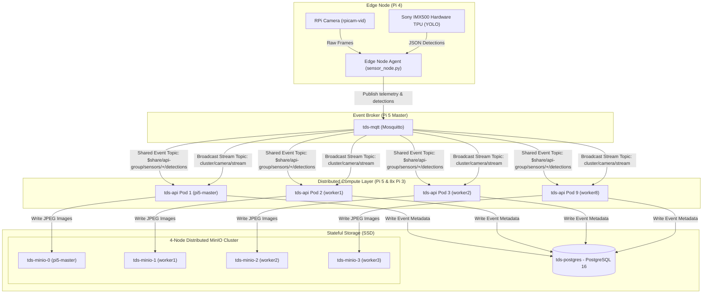
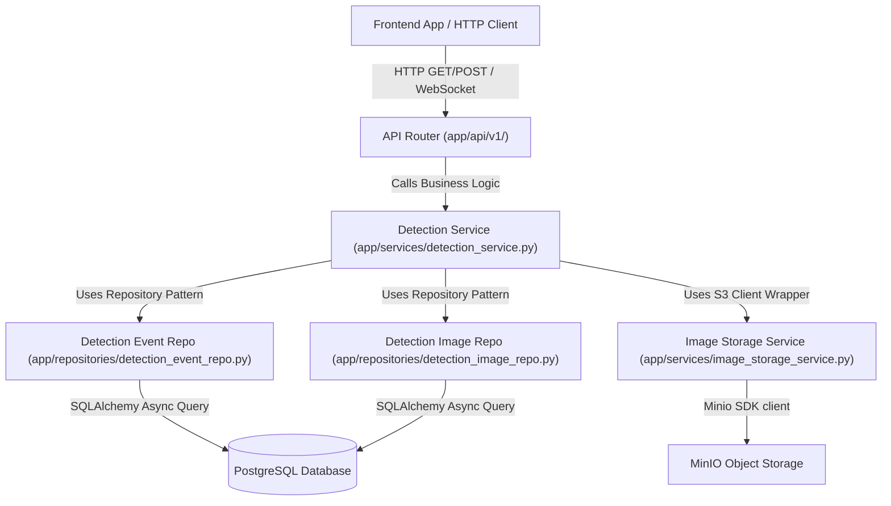
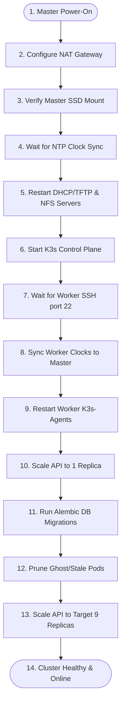

# Task 7 — Backend Architecture & Orchestration

The backend layer of the Threat Detection System (TDS) is designed as a highly available, event-driven, distributed microservice stack. It orchestrates real-time edge AI telemetry ingestion, stores metadata and images, and manages automated cluster self-healing across the Pi 5 Master and 8x Pi 3 B+ worker nodes.

---

## 1. System Integration Flow

This diagram illustrates how data flows from the physical camera on the Edge node, through the message broker, across the load-balanced compute nodes (FastAPI replicas), and into the SSD-backed databases.



### Shared Subscriptions ($share)
To support 9 replicas of the API running in parallel without duplicate data processing, we utilize **MQTT v5 Shared Subscriptions**:
* **Events (`$share/api-group/sensors/+/detections`)**: Ensures only **one** replica receives and processes each threat event, avoiding duplicate PostgreSQL writes and duplicate Telegram bot alerts.
* **Camera Stream (`cluster/camera/stream`)**: Subscribed to normally by all replicas, enabling any active user socket connected to any replica pod to receive the broadcast live frame.

---

## 2. Service-Repository Architecture

The FastAPI backend implements clean DDD (Domain-Driven Design) separation using the **Repository Pattern** and **Service Layers**. This decouples SQL querying and S3 bucket API handling from the REST endpoints.



### Layer Responsibilities:
1. **API Router**: Handles validation, security handshakes (JWT authentication), and parameter binding.
2. **Service Layer**: Manages business rules (e.g., determining if an event is a "threat", orchestrating S3 image saves before DB insertions, and calling notification channels).
3. **Repository Layer**: Encapsulates raw SQLAlchemy async sessions and isolates DB query logic from business services.
4. **Image Storage Service**: Wraps the MinIO client SDK, abstracting connection parameters and folder schemas (`detections/{id}/annotated.jpg`).

---

## 3. Key Objectives & Compliance

### 3.1 — True High-Availability & Cluster Scheduling
* **9 Replicas for Full Coverage**: Configured the deployment with exactly `9 replicas` to fully cover the cluster's physical topology: **1 backend instance on the Pi 5 Master** and **1 instance on each of the 8 Raspberry Pi 3 workers**.
* **Soft Pod Anti-Affinity**: Implemented hostname-based `podAntiAffinity` rules inside [backend.yaml](../../k8s/backend.yaml) to ensure Kubernetes dynamically spreads the 9 pods individually across all 9 unique physical nodes.
* **Auto-healing & Fault Tolerance**: If any Pi 3 node drops offline, the Traefik Ingress controller and Kubernetes scheduler automatically redirect traffic and reschedule the replica without dropping user sessions.

### 3.2 — Centralized Storage & S3 Compatibility
* **MinIO Storage Service**: Integrated **MinIO** inside the cluster (`tds-minio` Service) to serve as a high-performance S3 Object Storage API. 
* **Database Cataloging**: As base64-encoded AI threat captures are received, they are saved asynchronously into MinIO, and their metadata catalogs are recorded inside a transactional PostgreSQL database (`tds-postgres`).
* **SSD-Backed Persistent Volumes**: Stateful services run on high-performance SSD-backed volumes via K3s `local-path` storage, avoiding SD card write degradation.

---

## 4. Distributed MinIO S3 Integration

MinIO is configured as a **True 4-Node Distributed StatefulSet** with erasure coding. The storage volumes are mapped dynamically via K3s `local-path` storage class.

### NFS Compatibility Configuration:
Since the worker nodes are diskless PXE-booted nodes mounting their filesystems via NFS from the Pi 5 Master, MinIO requires special parameters in [minio.yaml](../../k8s/minio.yaml):

* **`MINIO_API_ODIRECT = off`**: NFS does not support POSIX Direct I/O (`O_DIRECT`). Disabling it redirects MinIO to use the standard Linux Page Cache.
* **`MINIO_CI_CD = on`**: Prevents MinIO from refusing to use the storage mount on NFS (which mounts as pseudo-device major: 0, triggering MinIO's "root drive partition protection" error).

### Commands to Audit Physical Files on Disk
Since all worker volumes are network-booted, the actual physical JPEGs stored inside MinIO are accessible directly on the **Pi 5 Master** SSD:

```bash
# 1. List all physically stored threat images on the master node
sudo find /nfs/nodes/ -name "annotated.jpg"

# 2. Count the total number of saved threat images
sudo find /nfs/nodes/ -name "annotated.jpg" | wc -l
```

---

## 5. 🔌 The Self-Healing Golden Boot Recovery

Because the control plane and network boot servers must start before the worker nodes can fetch their OS, we run an automated, persistent systemd service on the Master (`cluster-recovery.service`) executing `/usr/local/bin/cluster-boot-recovery.sh`.



### Solving Database Migration Deadlocks
When starting the cluster with multiple replicas (e.g. 9 pods), all pods start in parallel and run `alembic upgrade head` simultaneously on startup. This causes database deadlocks on PostgreSQL schema locks. 

The recovery script solves this **automatically on boot** by implementing the following logic:
1. Detects the target replica count (e.g., 9).
2. Scales the deployment down to **1 replica** dynamically.
3. Waits for the single replica to become healthy (which applies database migrations cleanly in isolation).
4. Scales the deployment back up to the target replica count (e.g., 9).

---

## 6. Technology Stack & Artifacts

* **FastAPI Core**: Lightweight asynchronous Python framework utilizing `asyncpg` for thread-safe database pooling and `paho-mqtt`/`aiomqtt` for telemetry ingestion.
* **Multi-stage Dockerfile**: Hardened production container packaging (`backend/Dockerfile`) running as a non-privileged user (`tds`).
* **Infrastructure-as-Code Manifests**:
  * [backend.yaml](../../k8s/backend.yaml) — Replicated FastAPI, Traefik Ingress, and node affinity rules.
  * [minio.yaml](../../k8s/minio.yaml) — S3 storage service setup.
  * [postgres.yaml](../../k8s/postgres.yaml) — Relational DB deployment.
  * [mqtt.yaml](../../k8s/mqtt.yaml) — Eclipse Mosquitto broker configurations.

---

## 7. Core Fixes & Troubleshooting History

To establish stable operational service, the following structural fixes were implemented in the backend:

1. **Unauthenticated Image Downloads**: Bypassed JWT auth checks on `/api/v1/images/{image_id}/download` inside [images.py](file:///Users/hanan/personal-projects/Threat-Detection-System/backend/app/api/v1/images.py). This allows standard HTML `` elements in the browser dashboard to render captured threat photos without needing to inject request headers.
2. **WebSocket CORS Restoration**: Configured the backend with the environment variable `BACKEND_CORS_ORIGINS` in [backend.yaml](file:///Users/hanan/personal-projects/Threat-Detection-System/k8s/backend.yaml) to whitelist `http://192.168.1.50/`. This resolves CORS checks on the live MJPEG camera stream WebSocket handshake (`/api/v1/stream/ws`).
3. **Prometheus fastapi Middleware Crash**: Setting `PROMETHEUS_ENABLED="false"` resolved a routing crash loop (`AttributeError: '_IncludedRouter' object has no attribute 'path'`) caused by a package mismatch inside the metrics middleware.
4. **Worker Registry Access**: Configured `/etc/rancher/k3s/registries.yaml` on all 8 worker nodes using Ansible to mirror `localhost:5000` pulls to the master registry at `http://192.168.1.50:5000`. This enables workers to pull backend API updates seamlessly.
5. **Multi-replica Message Duplication (Shared Subscriptions)**: Implemented MQTT v5 Shared Subscriptions (`$share/api-group/...`) in [mqtt_service.py](file:///Users/hanan/personal-projects/Threat-Detection-System/backend/app/services/mqtt_service.py) for events and health metrics to ensure exactly one replica processes database writes and dispatches the Telegram bot notifications, while maintaining standard broadcast for video frames.

---

## 8. K3s Kubernetes Cluster Configuration Details

To run a multi-node Kubernetes cluster distributed across network-booted, memory-constrained nodes, several low-level kernel, storage, and networking parameters were configured.

### 8.1 — Enabling Cgroups Memory Management
Raspberry Pi OS disables memory process limits by default. Running K3s without memory limit tracking triggers a immediate boot crash (`failed to find memory cgroup (v2)`).
* **Fix**: Append kernel command-line variables to `/boot/firmware/cmdline.txt` on the Master and `/tftpboot/cmdline.txt` (or PXE configurations) for the workers:
  ```text
  cgroup_enable=cpuset cgroup_enable=memory cgroup_memory=1
  ```

### 8.2 — Native Snapshotter & Kubelet Ingestion Timeout on NFS
Because worker nodes mount `/` over NFS, K3s cannot use standard overlayfs for docker layer isolation. It falls back to the **`native` snapshotter**, which performs file-by-file deep copies of container image structures.
* **The Blocker**: A deep copy of Python base images (~820MB, thousands of packages) over the 100Mbps Ethernet local switch takes 3 to 4 minutes, overloading the Pi 3 workers' CPU. The default Kubelet timeout (`runtime-request-timeout` = 2m) would abort the container creation midway, leaving orphaned containerd namespaces.
* **Fix**: Modified the worker agent service `/lib/systemd/system/k3s-agent.service` on the shared rootfs, appending `runtime-request-timeout=15m` to the execution daemon:
  ```ini
  ExecStart=/usr/local/bin/k3s agent --snapshotter native --kubelet-arg=runtime-request-timeout=15m
  ```

### 8.3 — Dual-Homed Network Masquerading & DNS Gateways
The Pi 5 Master is connected to both **Wi-Fi** (`wlan0` - internet, `192.168.1.x`) and **Ethernet** (`eth0` - private switch for workers, `192.168.1.x`).
* **The Blocker**: Local switch DNS calls defaults to the lower Ethernet routing metric (200), bypassing the Wi-Fi gateway (600) and locking out external requests.
* **Fix**: Setup IP Masquerading (NAT) on the Master to share its Wi-Fi network interface with the private Ethernet switch interface, allowing workers to reach external registries:
  ```bash
  sudo iptables -t nat -A POSTROUTING -o wlan0 -j MASQUERADE
  sudo iptables -I FORWARD 1 -i eth0 -o wlan0 -j ACCEPT
  sudo iptables -I FORWARD 1 -m state --state RELATED,ESTABLISHED -j ACCEPT
  ```

### 8.4 — Resolving PXE Volatile RAM Overlay (`/etc/resolv.conf`)
* **The Blocker**: Network-booted worker nodes mount `/etc` as volatile RAM overlays (`tmpfs`). Editing the static base image on the master does not dynamically update active nodes' DNS, which still holds dead local gateways.
* **Fix**: Injected public resolvers directly into active nodes' runtime memory using Ansible:
  ```bash
  ansible workers -i ~/pi-cluster/hosts.ini -m shell -a "printf 'nameserver 8.8.8.8\nnameserver 1.1.1.1\n' | sudo tee /etc/resolv.conf" --become
  ```

### 8.5 — Containerd Sandbox Pause Image cache warming
* **The Blocker**: Workers booting under DNS lockouts failed to pull the K3s networking sandbox (`rancher/mirrored-pause:3.6`) and entered exponential retry back-off loops, stalling container creation indefinitely.
* **Fix**: Used Ansible to manually force-pull the pause image into the K3s local runtime cache across all workers, waking up the pending scheduler threads instantly:
  ```bash
  ansible workers -i ~/pi-cluster/hosts.ini -m shell -a "sudo k3s crictl pull rancher/mirrored-pause:3.6" --become
  ```

---

## 9. Manual Troubleshooting Cheat Sheet

### A. Run a Manual Cluster-Wide Sync & Time Alignment
If the nodes booted out of order or some nodes have drifted clocks causing TLS connection issues:
```bash
sudo /usr/local/bin/cluster-boot-recovery.sh
```

### B. Manually Reset Active PostgreSQL Locks
If the API gets stuck on migrations due to an unclean database connection termination:
```bash
# 1. View blocking PIDs
sudo kubectl exec -it deploy/tds-postgres -- psql -U tds_user -d threat_detection -c "
SELECT pid, query, state, age(clock_timestamp(), query_start) FROM pg_stat_activity WHERE state != 'idle';
"

# 2. Terminate the blocking PID (replace <PID> with the ID from above)
sudo kubectl exec -it deploy/tds-postgres -- psql -U tds_user -d threat_detection -c "SELECT pg_terminate_backend(<PID>);"
```

### C. Scale API Manually for Startup
If manually applying manifests:
```bash
# Scale down to run Alembic migration
sudo kubectl scale deployment tds-api --replicas=1

# Once pod is Ready/Running, scale back to target
sudo kubectl scale deployment tds-api --replicas=9
```
