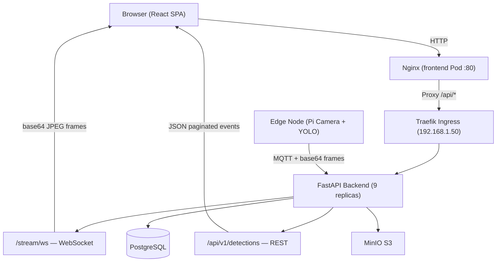
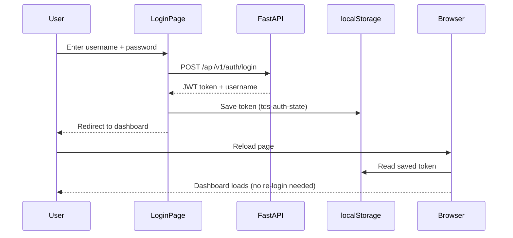
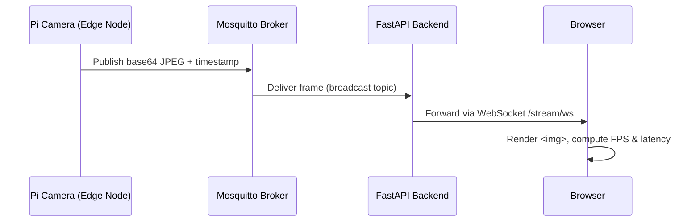

# Task 8 — Frontend Dashboard

The frontend of the Threat Detection System is a React + TypeScript single-page application deployed on the K3s cluster. It provides security operators with a real-time surveillance dashboard: a live camera feed streamed directly from the edge node, continuous detection event monitoring, historical event search, and cluster monitoring links.

---

## 1. Team & Presentation Split

| Order | Presenter | Sections | Contribution Area |
|---|---|---|---|
| **1st** | **Md. Forman Ullah Sajib** | 2, 3, 4, 5, 6 | Backend–frontend wiring, authentication, live camera stream, detection data, deployment |
| **2nd** | **Javier de Santiago** | 7, 8, 9, 10 | Application structure, design system, pages, UI components |

---

## 2. How the Frontend Connects to the Backend



The browser always talks to port 80 on the Nginx pod. Nginx forwards every `/api/*` request to the backend through Traefik, which load-balances across the 9 FastAPI replicas. This single-origin setup eliminates all CORS issues for both REST calls and the WebSocket camera stream upgrade handshake.

---

## 3. Authentication



- On every API call, the token is attached automatically: `Authorization: Bearer <token>`
- If the token is missing or expired, the user is redirected back to the login page
- Registration supports three roles: `viewer`, `operator`, `admin`
- The token is also passed as a query parameter when opening the WebSocket: `/stream/ws?token=<jwt>`

---

## 4. Live Data Integration

### 4.1 — Live Camera Feed (WebSocket)

The camera stream is the most real-time component of the dashboard. Standard REST polling would be too slow for video frames, so a persistent WebSocket connection is used instead.



- The browser opens the WebSocket connection on page load (after login)
- Each message from the backend contains a **base64-encoded JPEG** and a **timestamp**
- The dashboard renders the frame immediately by setting it as the `src` of an `` element
- **Latency** is calculated as: `current time in browser − timestamp on the frame` — shows the full delay from camera to screen
- **FPS** is a rolling average over the last 10 frames
- If the connection drops (e.g. a backend pod restarts), it automatically reconnects after 5 seconds
- Status badge shows: `Live` / `Connecting` / `Offline`

### 4.2 — Live Detection Panel

- Calls `GET /api/v1/detections/recent?limit=8` every **10 seconds**
- Displays the 8 most recent detection events as cards with severity colour-coding: `critical`, `high`, `medium`, `low`
- Auto-refresh can be paused with a toggle button
- Click any card to expand it and see:
  - The raw detection data from YOLO (bounding boxes, labels)
  - The metadata object
  - The annotated JPEG image saved in MinIO

### 4.3 — Event Search & Filter

- Filter by: event type, severity, sensor ID, whether acknowledged, start/end time, page size
- Results are paginated — total count and current offset are shown
- Same expandable card layout as the live panel

### 4.4 — How Images Are Loaded from MinIO

Detection images are stored in MinIO (S3-compatible object storage). To display them in the browser:

1. The detection card fetches the event detail from `GET /api/v1/detections/{id}`
2. The response includes the MinIO storage key for each image
3. The browser loads the image directly via `GET /api/v1/images/{id}/download`

This endpoint has **no JWT check** — deliberately. A standard `` HTML tag cannot attach custom headers, so the image endpoint is made publicly accessible while the event data endpoints remain protected.

---

## 5. Deployment — Docker + Kubernetes

### Multi-Stage Dockerfile

The frontend uses a two-stage build so the final container image contains only Nginx and the compiled static files — no Node.js, no build tools:

```
Stage 1 (node:20-alpine)    →   npm install + vite build  →  /dist
Stage 2 (nginx:1.25-alpine) →   copy /dist + nginx.conf   →  serve on :80
```

### Nginx Configuration

```nginx
location /api/ {
    proxy_pass http://tds-api:8000/api/;
    proxy_http_version 1.1;
    proxy_set_header Upgrade $http_upgrade;
    proxy_set_header Connection "upgrade";
}
```

The `Upgrade` and `Connection` headers are required so that the WebSocket handshake passes through Nginx to the backend — without these, the live camera stream would fail to connect.

## 6. Key Technical Decisions

### 6.1 — WebSocket over browser-side MQTT
Rather than running an MQTT client directly in the browser (which would require a WebSocket-to-MQTT bridge and additional broker configuration), the frontend connects to the FastAPI `/stream/ws` endpoint, which acts as the relay. This keeps the browser's protocol surface minimal and the MQTT broker configuration unchanged.

### 6.2 — Unauthenticated image download endpoint
Standard `` elements cannot attach custom request headers. The MinIO image endpoint `/images/{id}/download` was made publicly accessible (no JWT required) so that threat capture thumbnails render natively in HTML without JavaScript fetch workarounds.

### 6.3 — Runtime-configurable API URL
The API base URL is persisted in `localStorage` via the Settings page. The same Docker image therefore works against the Pi5 standalone endpoint (`http://192.168.1.50:8000`) and the Traefik-proxied cluster endpoint (`http://192.168.1.50/api/v1`) without any rebuild.

### 6.4 — Nginx as reverse proxy
All `/api/*` browser requests go to port 80 on the frontend Nginx pod, which proxies them to the backend service. This makes the browser see a single origin — eliminating CORS for both REST and the WebSocket upgrade handshake.

### Kubernetes (`frontend.yaml`)

- **Deployment**: 1 replica — the frontend is stateless (all data lives in the backend)
- **Service**: ClusterIP on port 80
- **Ingress**: Traefik routes `http://192.168.1.50/` to this pod; `/api/*` is forwarded to the backend service

---

## 7. Application Structure & Design System
*Presenter: Javier de Santiago*

### 7.1 — Project Initialisation & Tooling
- **React + TypeScript + Vite** project scaffolded as the build foundation
- **TailwindCSS** integrated with a custom extended colour palette and `@tailwindcss/forms`
- **Prettier** with Tailwind plugin enforced via **Husky** pre-commit hooks for consistent code style across the team
- **React Router v6** configured with nested routes and a `RouterProvider`, separating the public landing from the authenticated app shell

### 7.2 — Landing Page
The public-facing landing page introduces the project to visitors before login:

- **HeroHome** — animated headline with `PageIllustration` and `Spotlight` SVG effects
- **Features** section — capability overview cards
- **Workflows** section — pipeline description
- **CTA** section — call-to-action block
- **Header** — navigation with logo and links
- **Footer** — team credits and tech stack wordmarks (custom SVGs)
- **AOS (Animate on Scroll)** library integrated for entrance animations; disabled dynamically on small screens

### 7.3 — Authenticated Application Pages

| Page | Route | Description |
|---|---|---|
| Home / Dashboard | `/home` | Detection dashboard and summary cards |
| Operations | `/operations` | Sensor operations and management tables |
| Search Events | `/search` | Historical event search with filters |
| Graphs | `/graphs` | Amdahl's & Gustafson's Law scaling results with Chart.js |
| Docs | `/docs` | MkDocs documentation links |
| Settings | `/settings` | API configuration and user preferences |
| Login / Register | `/login` | Tabbed authentication form |
| Profile | `/profile` | User profile page |

### 7.4 — Reusable Component Library
- `Button` — reusable variant-aware button component
- `Logo` / wordmark SVGs — brand assets
- `HomeSidebar` — collapsible mobile navigation with toggle
- Custom **Nacelle** font family loaded via `@font-face`
- PWA manifest and updated favicon

---

## 8. UI Pages — Detail

### 8.1 — GraphsPage (Scaling Law Results)
- Displays **Amdahl's Law** and **Gustafson's Law** benchmark results from the cluster benchmarking task
- Line charts rendered with **Chart.js** with custom colour palettes, tooltip styling, and typed options
- Tables with multi-line headers, column width adjustments, and **horizontal drag-to-scroll** on mobile
- Responsive layout switching between grid and flex depending on viewport

### 8.2 — OperationsPage
- Sectioned tables showing sensor operations and system status
- Consistent `operationsErrorClass` centralised error styling
- Responsive layout fixes for narrow viewports

### 8.3 — DocsPage
- Type-safe documentation URL map
- Section cards linking to the MkDocs documentation site

### 8.4 — SettingsPage
- API Base URL configuration
- Flex-based responsive layout with updated button styles

---

## 9. Technology Stack

| Technology | Purpose |
|---|---|
| React 18 + TypeScript | UI framework, type-safe components |
| Vite | Dev server + production build |
| TailwindCSS | Utility-first styling with custom palette |
| React Router v6 | Client-side routing and protected routes |
| Chart.js | Benchmark result visualisation |
| AOS | Scroll-triggered animations |
| Prettier + Husky | Code style enforcement |
| Nginx 1.25 (Alpine) | Static file serving + API reverse proxy |
| Docker | Container packaging |
| Kubernetes (k3s) | Cluster deployment |

---

## 10. Related Files

- [frontend/src/App.tsx](../../frontend/src/App.tsx) — Data integration dashboard (auth, WebSocket, detections, search)
- [frontend/Dockerfile](../../frontend/Dockerfile) — Multi-stage production container
- [frontend/nginx.conf](../../frontend/nginx.conf) — Nginx reverse proxy + WebSocket passthrough
- [k8s/frontend.yaml](../../k8s/frontend.yaml) — Kubernetes Deployment, Service, and Ingress
- [backend/app/services/mqtt_service.py](../../backend/app/services/mqtt_service.py) — MQTT Shared Subscription service (backend side of the camera stream)
- [edge_node/edge_camera_publisher.py](../../edge_node/edge_camera_publisher.py) — Pi Camera MQTT publisher

---
