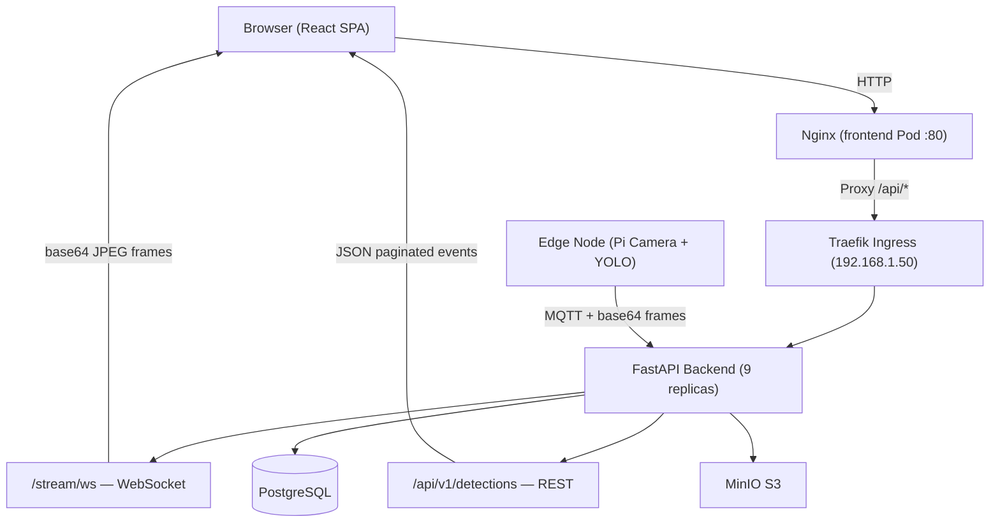
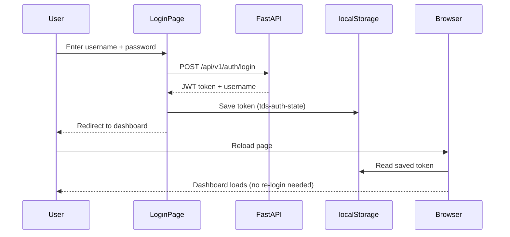
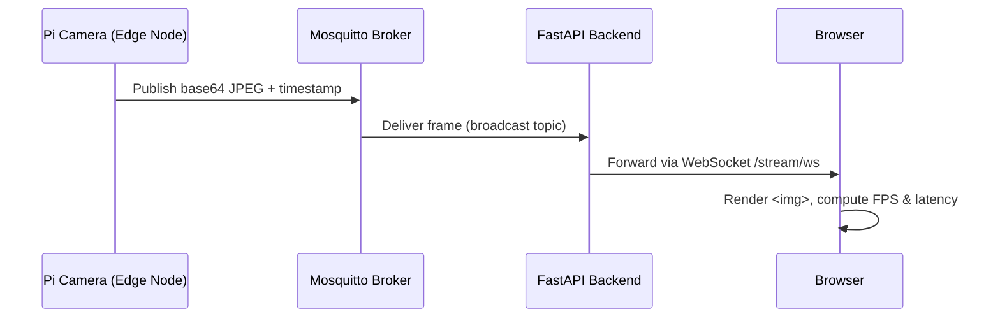

# Task 8 — Frontend

The frontend is **ThreatOff**, a React 19 + TypeScript dashboard for the Threat Detection System. It is a client-rendered app built with Vite and routed with **React Router 7** (data router, with several routes lazy-loaded): a public marketing site, a docs page, an auth screen, and an authenticated dashboard with six routes (overview, camera, search, settings, scaling results, operations). It talks to the FastAPI backend over REST, a backend-relayed WebSocket, and — for the raw camera preview — directly to the MQTT broker over WebSocket. The app is packaged as a Docker container (Nginx-served static bundle) and deployed to the k3s cluster.

**Tech stack:** React 19, TypeScript 5.6, Vite 6, React Router 7, Tailwind CSS 4, AOS (scroll animations), Nginx. No component library — everything is hand-built with Tailwind utility classes and a shared brand color palette.

---

## 1. Team & Presentation Split

| Order   | Presenter                  | Sections        | Contribution Area                                                                       |
|---------|----------------------------|-----------------|-----------------------------------------------------------------------------------------|
| **1st** | **Md. Forman Ullah Sajib** | 2, 3, 4, 5, 6   | Backend–frontend wiring, authentication, live camera stream, detection data, deployment |
| **2nd** | **Javier de Santiago**     | 7, 8, 9, 10     | Application structure, routing, design system, pages, UI components                     |

---

## 2. How the Frontend Connects to the Backend



The browser always talks to port 80 on the Nginx pod. Nginx forwards every `/api/*` request to the backend through Traefik, which load-balances across the 9 FastAPI replicas. This single-origin setup eliminates all CORS issues for both REST calls and the WebSocket camera stream upgrade handshake.

---

## 3. Authentication



- On every API call, the token is attached automatically: `Authorization: Bearer <token>`
- If the token is missing or expired, the user is redirected back to the login page
- Registration supports three roles: `viewer`, `operator`, `admin`
- The token is also passed as a query parameter when opening the WebSocket: `/stream/ws?token=<jwt>`

---

## 4. Live Data Integration

### 4.1 — Live Camera Feed (WebSocket)

The camera stream is the most real-time component of the dashboard. Standard REST polling would be too slow for video frames, so a persistent WebSocket connection is used instead.



- The browser opens the WebSocket connection on page load (after login)
- Each message from the backend contains a **base64-encoded JPEG** and a **timestamp**
- The dashboard renders the frame immediately by setting it as the `src` of an `` element
- **Latency** is calculated as: `current time in browser − timestamp on the frame` — shows the full delay from camera to screen
- **FPS** is a rolling average over the last 10 frames
- If the connection drops (e.g. a backend pod restarts), it automatically reconnects after 5 seconds
- Status badge shows: `Live` / `Connecting` / `Offline`

### 4.2 — Live Detection Panel

- Calls `GET /api/v1/detections/recent?limit=8` every **10 seconds**
- Displays the 8 most recent detection events as cards with severity colour-coding: `critical`, `high`, `medium`, `low`
- Auto-refresh can be paused with a toggle button
- Click any card to expand it and see:
    - The raw detection data from YOLO (bounding boxes, labels)
    - The metadata object
    - The annotated JPEG image saved in MinIO

### 4.3 — Event Search & Filter

- Filter by: event type, severity, sensor ID, whether acknowledged, start/end time, page size
- Results are paginated — total count and current offset are shown
- Same expandable card layout as the live panel

### 4.4 — How Images Are Loaded from MinIO

Detection images are stored in MinIO (S3-compatible object storage). To display them in the browser:

1. The detection card fetches the event detail from `GET /api/v1/detections/{id}`
2. The response includes the MinIO storage key for each image
3. The browser loads the image directly via `GET /api/v1/images/{id}/download`

This endpoint has **no JWT check** — deliberately. A standard `` HTML tag cannot attach custom headers, so the image endpoint is made publicly accessible while the event data endpoints remain protected.

---

## 5. Deployment — Docker + Kubernetes

### Multi-Stage Dockerfile

The frontend uses a two-stage build so the final container image contains only Nginx and the compiled static files — no Node.js, no build tools:

```
Stage 1 (node:20-alpine)    →   npm install + vite build  →  /dist
Stage 2 (nginx:1.25-alpine) →   copy /dist + nginx.conf   →  serve on :80
```

### Nginx Configuration

```nginx
location /api/ {
    proxy_pass http://tds-api:8000/api/;
    proxy_http_version 1.1;
    proxy_set_header Upgrade $http_upgrade;
    proxy_set_header Connection "upgrade";
}
```

The `Upgrade` and `Connection` headers are required so that the WebSocket handshake passes through Nginx to the backend — without these, the live camera stream would fail to connect.

## 6. Key Technical Decisions

### 6.1 — WebSocket over browser-side MQTT
Rather than running an MQTT client directly in the browser (which would require a WebSocket-to-MQTT bridge and additional broker configuration), the frontend connects to the FastAPI `/stream/ws` endpoint, which acts as the relay. This keeps the browser's protocol surface minimal and the MQTT broker configuration unchanged.

### 6.2 — Unauthenticated image download endpoint
Standard `` elements cannot attach custom request headers. The MinIO image endpoint `/images/{id}/download` was made publicly accessible (no JWT required) so that threat capture thumbnails render natively in HTML without JavaScript fetch workarounds.

### 6.3 — Runtime-configurable API URL
The API base URL is persisted in `localStorage` via the Settings page. The same Docker image therefore works against the Pi5 standalone endpoint (`http://192.168.1.50:8000`) and the Traefik-proxied cluster endpoint (`http://192.168.1.50/api/v1`) without any rebuild.

### 6.4 — Nginx as reverse proxy
All `/api/*` browser requests go to port 80 on the frontend Nginx pod, which proxies them to the backend service. This makes the browser see a single origin — eliminating CORS for both REST and the WebSocket upgrade handshake.

### Kubernetes (`frontend.yaml`)

- **Deployment**: 1 replica — the frontend is stateless (all data lives in the backend)
- **Service**: ClusterIP on port 80
- **Ingress**: Traefik routes `http://192.168.1.50/` to this pod; `/api/*` is forwarded to the backend service

---

## 7. Routing & Application Shell

`src/router/index.tsx` defines the route tree with `createBrowserRouter`. Public routes render inside `Root`'s marketing header/footer; `/auth` is gated by `RedirectIfAuthed`; everything else lives under `HomeLayout` behind `RequireAuth` and is lazy-loaded per route.

| Path          | Guard                                               | Notes                                                |
|:--------------|:----------------------------------------------------|:-----------------------------------------------------|
| `/landing`    | none                                                | Public landing page — hero, workflows, features, CTA |
| `/docs`       | none                                                | Public docs page                                     |
| `/auth`       | `RedirectIfAuthed` — sends logged-in users to `/`   | Login / registration                                 |
| `/`           | `RequireAuth` — sends anonymous users to `/landing` | Overview dashboard                                   |
| `/camera`     | `RequireAuth`                                       | Direct MQTT camera preview                           |
| `/search`     | `RequireAuth`                                       | Historical detection search                          |
| `/settings`   | `RequireAuth`                                       | API connection settings                              |
| `/graphs`     | `RequireAuth`                                       | Amdahl/Gustafson scaling results                     |
| `/operations` | `RequireAuth`                                       | Backend operations console                           |

Authenticated routes share a sticky sidebar (`HomeSidebar`) and a route-transition progress bar (`RoutePendingBar`), grouped into **Dashboard** (Overview, Camera stream, Search events), **System** (Settings, Operations, Docs, Scaling results, Grafana, Swagger UI), and **Account** (Sign out) — with the logged-in username and initials avatar in the footer.

---

## 8. Pages

### 8.1 — Landing (`/landing`)

Public marketing page with a hero (`HeroHome`), a workflows section, a features grid, and a call-to-action, wrapped by `Root`'s shared header/footer and animated with AOS.

### 8.2 — Docs (`/docs`)

Public hero section (`DocsHero`/`DocsOverview`) summarizing the project and linking out to the full documentation site.

### 8.3 — Camera Stream (`/camera`)

Connects directly to the MQTT broker over WebSocket via the Paho MQTT client (loaded from a CDN), separate from the Overview page's relayed feed described in [§4. Live Data Integration](#4-live-data-integration). The broker IP and WebSocket port are user-configurable (defaults `192.168.1.50` / `9001`); it subscribes to `cluster/camera/stream` and shows **Connecting** / **Connect** / **Disconnect** status with inline errors on failure.

### 8.4 — Search Events (`/search`)

Queries `GET /api/v1/detections` with the filters below, reusing the same expandable detection cards described in [§4](#4-live-data-integration). "Search detections" fires the query; "Clear filters" resets everything. Results show `{total} result(s)` and `Showing {n} item(s)`.

| Field            | API parameter              |
|:-----------------|:---------------------------|
| Event type       | `event_type`               |
| Severity         | `severity`                 |
| Sensor ID        | `sensor_id`                |
| Acknowledged     | `acknowledged`             |
| Start / End time | `start_time` / `end_time`  |
| Skip / Limit     | `skip` / `limit` (max 200) |

### 8.5 — Settings (`/settings`)

Lets the operator see the signed-in username, edit the **API base URL** (persisted to `localStorage` via `useApiSettings`, defaults to `VITE_API_BASE_URL`), open Swagger UI, or sign out.

### 8.6 — Scaling Results (`/graphs`)

Renders the Task 4 Amdahl/Gustafson benchmarks as native React components instead of an embedded iframe: `Graphs` loads Chart.js from a CDN (`chartLoader.ts`) and draws two canvases (`ChartCard`) backed by static data in `graphsData.ts`, followed by `AmdahlTable`/`GustTable` with the full results (flagging Amdahl rows missing speedup values).

### 8.7 — Operations (`/operations`)

A tabbed "backend console" that surfaces most of the read-only backend surface in one place. `useBackendConsole` fires all requests in parallel (`Promise.allSettled`, so one failing endpoint doesn't block the rest) and exposes a manual "Refresh data" action; each tab uses a shared `operationsErrorClass` for consistent error styling.

| Tab            | Backed by                                                                                   |
|:---------------|:--------------------------------------------------------------------------------------------|
| Overview       | `GET /dashboard/summary`                                                                    |
| Detections     | `GET /detections/recent?limit=12`                                                           |
| Logs           | `GET /logs?limit=20`                                                                        |
| Nodes          | `GET /infrastructure/status` (node inventory + health)                                      |
| Notifications  | `GET /notifications?limit=20`                                                               |
| Infrastructure | `GET /infrastructure/status`, `GET /infrastructure/services`, `GET /infrastructure/storage` |
| Cluster        | `GET /cluster/mpi/history?limit=8`, `GET /cluster/mpi/scaling-comparison`                   |
| Auth           | `GET /auth/me` (current session's profile)                                                  |
| Metrics        | `GET /metrics` (raw Prometheus exposition, previewed and shown in full)                     |

The header strip shows four live stat tiles (detections, nodes, notifications, connected services) and quick links to `/docs` and `<api-origin>/docs` (Swagger UI).

---

## 9. Technology Stack

| Component                 | Details                                                                                                 |
|:--------------------------|:--------------------------------------------------------------------------------------------------------|
| React 19 + TypeScript 5.6 | Client-rendered app, routed with React Router 7                                                         |
| Vite 6                    | Dev server + production static bundle                                                                   |
| Tailwind CSS 4            | Utility-first styling with a shared brand color palette                                                 |
| AOS                       | Scroll-triggered entrance animations                                                                    |
| Paho MQTT / Chart.js      | Loaded from CDN at runtime (camera preview and scaling charts only)                                     |
| Nginx                     | Serves the static bundle, SPA-style fallback, proxies `/docs`, `/redoc`, `/openapi.json` to the backend |

**Environment variable:** `VITE_API_BASE_URL` (default `/api/v1`) — baked into the bundle at build time. Note that `nginx.conf` does **not** proxy `/api/`, so in practice the API base URL must point at a reachable backend origin (directly, or overridden per-session from the Settings page, which persists the choice to `localStorage`).

---

## 10. Related Files / Artifacts

| File                                        | Details                                             |
|:--------------------------------------------|:----------------------------------------------------|
| `frontend/Dockerfile` | Multi-stage: `node:20-alpine` → `nginx:1.27-alpine` |
| `frontend/nginx.conf` | Route fallback + Swagger/OpenAPI proxy              |
| `k8s/frontend.yaml`     | Kubernetes Deployment + Service + Ingress           |

---
