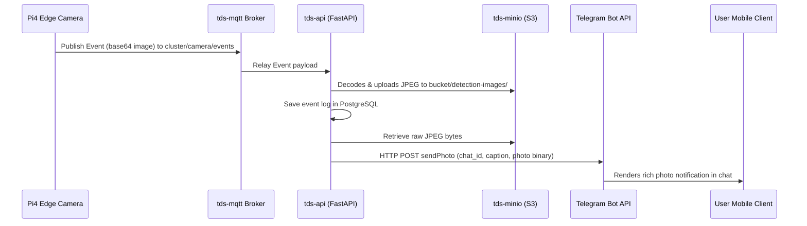

# Task 9 — Telegram Notifications

The Threat Detection System implements real-time security alerts directly to Telegram using the Telegram Bot API. By utilizing the backend's access to both relational event logs and S3 image storage, threat alerts are dispatched under 1 second with a photo of the captured threat.

---

## 1. Alerting Architecture & Data Flow

1. **Edge Trigger**: When the edge camera parses a threat detection (`weapon` or `fire`) from the IMX500 hardware TPU stream, it publishes the event payload containing the base64-encoded image frame to `cluster/camera/events`.
2. **Backend Processing**: The backend API MQTT subscriber receives the payload, uploads the image to the distributed `tds-minio` object store, and persists the metadata database record.
3. **Async Dispatch**: If the event has a severity of `HIGH` or `CRITICAL` (e.g. weapons, fire, vandalism), the backend initiates an asynchronous, non-blocking background task.
4. **Image Retrieval & API Call**: The background task fetches the raw JPEG bytes from MinIO and triggers the Telegram Bot API `sendPhoto` endpoint, forwarding the photo along with the threat metadata (confidence, node, type, timestamp) to the configured Telegram Chat.

---

## 2. Configuration & Credentials

The Telegram integration is configured in [backend.yaml](../../../k8s/backend.yaml) via the following environment variables:

| Variable | Description | Source / Reference |
| :--- | :--- | :--- |
| `TELEGRAM_BOT_TOKEN` | The unique API HTTP Token of your bot from `@BotFather`. | Loaded securely from Kubernetes Secret `telegram-credentials` |
| `TELEGRAM_CHAT_ID` | Your Telegram User ID or Group Chat ID. | Loaded securely from Kubernetes Secret `telegram-credentials` |

---

## 3. Bot Commands & Setup

To reconfigure or create a new alert bot:

1. **Create Bot**: Message `@BotFather` on Telegram, send `/newbot`, choose a name and a username ending in `bot`. Copy the returned API Token.
2. **Find Chat ID**: Message `@userinfobot` or `@myidbot` on Telegram, click **Start**, and copy the returned numerical `Id`.
3. **Authorize Chat**: Search for your bot username (e.g., `@threatalert2000bot`) and click **Start** to allow it to send you private DMs.
4. **Deploy**: Update the keys in `backend.yaml` and run `kubectl apply -f k8s/backend.yaml`.

---

## 4. Verification

To verify that Telegram notifications are working:
- Confirm that the `tds-api` logs print `Telegram threat alert delivered successfully` when an alert triggers.
- Trigger a threat manually by presenting a weapon (e.g. scissors/knife) or fire (e.g. a match) to the camera.
- The bot will send a notification structured as follows:
  > **⚠️ CRITICAL threat detected: EventType.FIRE (confidence: 96%)**  
  > *[JPEG attachment]*

