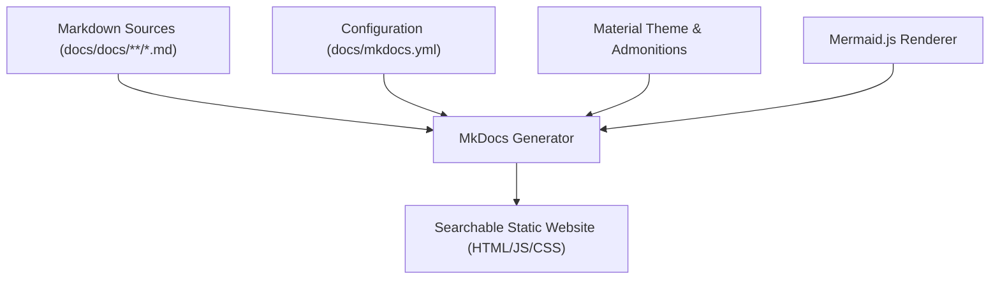

# Task 10 — Project Documentation & CI/CD Pipeline

The project documentation repository serves as a centralized, academic, and operational hub. It compiles all guides, task reports, design choices, and system verification protocols for the Threat Detection System.

---

## 1. Documentation Setup (MkDocs & Material)

We use the static site generator **MkDocs** with the **Material theme** (`mkdocs-material`) to compile and render Markdown documents into an interactive, fully searchable web application.



### Key Configuration Highlights (`mkdocs.yml`):
*   **Theme and Palette**: Responsive dark-mode and light-mode palette configuration with automated brightness toggles.
*   **Mermaid Integration**: Pre-configured using the `mermaid.min.js` client-side library and `pymdownx.superfences` custom fences to render flowcharts, sequence diagrams, and system layouts dynamically.
*   **Advanced Markdown Extensions**:
    *   `admonition` & `pymdownx.details` for collapsible information blocks and alerts.
    *   `pymdownx.highlight` for syntax highlighting with code copy shortcuts.
    *   `tables` & `attr_list` for database metrics and system requirements.

---

## 2. CI/CD Ingestion Pipeline (GitHub Actions)

To guarantee that the documentation is always synchronized, we implemented an automated continuous deployment pipeline using GitHub Actions.

```mermaid
graph LR
    Push([git push to main]) --> Trigger["GitHub Actions (docs.yml)"]
    Trigger --> VM["Ubuntu-Latest Runner VM"]
    VM --> Checkout["Checkout Code (actions/checkout)"]
    Checkout --> Python["Setup Python 3.12 (actions/setup-python)"]
    Python --> Deps["Install dependencies (pip install mkdocs-material)"]
    Deps --> Deploy["Build & Deploy (mkdocs gh-deploy --force)"]
    Deploy --> Pages["GitHub Pages Host (Public Website)"]
```



### Workflow Specification (`.github/workflows/docs.yml`):
*   **Path Filtering**: The action triggers **only** when files inside the `docs/` directory path are updated on the `main` or `service-repository-backend-v1` branches, preventing unnecessary runner builds.
*   **Permissions Overlay**: The workflow is granted write permission for the repository contents (`contents: write`) to allow the runner to push generated static assets to the `gh-pages` branch.
*   **Force Deployment**: Runs `mkdocs gh-deploy --force` to clean build the latest static site and update the production deployment automatically.

---

## 3. Operational Reference

### Build and Run Locally
If you want to view, write, or preview the documentation locally on your laptop:

```bash
# 1. Navigate to the docs folder
cd ~/Threat-Detection-System/docs

# 2. Install requirements
pip install -r requirements.txt

# 3. Serve the site locally (starts hot-reloading dev server at http://127.0.0.1:8000)
mkdocs serve
```

### Triggering Production Deployment
Whenever you add or modify a guide, simply commit and push your changes:
```bash
git add docs/
git commit -m "docs: describe task 10 documentation setup and CI/CD"
git push
```
GitHub Actions will automatically pick up the change, compile the assets, and update the live website within 30 seconds!
